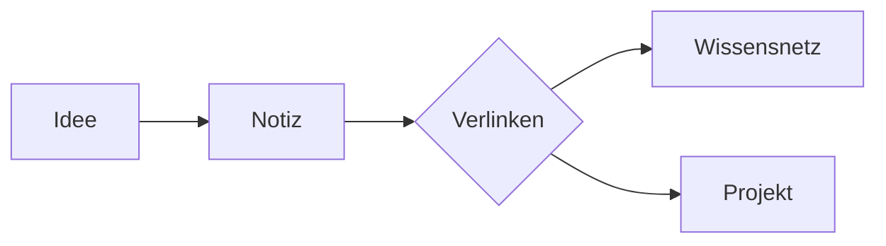

# Markdown Referenz

Diese Notiz zeigt die wichtigsten Formatierungen — ideal, um die drei Editor-Modi zu vergleichen.

## Textauszeichnung

**Fett**, *kursiv*, ==hervorgehoben==, ~~durchgestrichen~~ und `Code im Fließtext`.

## Listen und Aufgaben

1. Nummerierte Liste
2. Zweiter Punkt
   - Verschachtelte Aufzählung
   - Noch ein Punkt

- [ ] Offene Aufgabe
- [x] Erledigte Aufgabe
- [ ] Aufgabe mit Termin (@[[2026-07-12]])

## Callouts

> [!tip] Tipp
> Callouts heben wichtige Hinweise hervor. Es gibt sie auch als `info`, `warning` und `quote`.

## Tabelle

| Modus     | Zweck                         |
| --------- | ----------------------------- |
| Lesen     | Formatiert lesen und editieren |
| Schreiben | Live-Vorschau beim Tippen     |
| Markdown  | Roher Quelltext               |

## Code

```python
def merksatz():
    return "Ein Gedanke pro Notiz"
```

## Diagramm (Mermaid)



## Mathematik

Die Vergessenskurve: $R = e^{-t/S}$ — Behaltensrate $R$ fällt exponentiell mit der Zeit $t$.

## Links

Interne Links: [[Wissensnetz]] oder mit eigenem Text [[Zettelkasten-Methode|zur Methode]]. Externe: [markdownguide.org](https://www.markdownguide.org).
