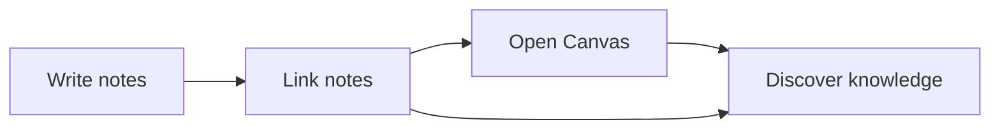

# Markdown Showcase

This note shows you everything Markdown can do in MindGraph. See also [[01 - Getting Started]] for the basics.

## Text Formatting

**Bold**, *italic*, ~~strikethrough~~, ==highlighted==, `code`

## Tables

| Feature | Description | Status |
|---------|------------|--------|
| Wikilinks | Link notes | Active |
| Canvas | Knowledge graph | Active |
| Flashcards | Spaced repetition | Active |
| Local AI | Ollama/LM Studio | Optional |

## Callouts

> [!note] Note
> Callouts are colored info boxes for important information.

> [!tip] Tip
> You can create callouts with `> [!type]`. Types: note, tip, warning, info, question.

> [!warning] Warning
> Callouts can also be collapsed.

## Tasks

- [x] Install MindGraph
- [x] Read the Welcome note
- [ ] Create your first note
- [ ] Link two notes together
- [ ] Try the Canvas

## Code

```python
# MindGraph supports syntax highlighting
def knowledge_network():
    notes = ["Idea A", "Idea B", "Idea C"]
    for note in notes:
        print(f"Linking: [[{note}]]")
```

## Math (LaTeX)

Inline: $E = mc^2$

Block:
$$
\int_{0}^{\infty} e^{-x^2} dx = \frac{\sqrt{\pi}}{2}
$$

## Mermaid Diagrams



## Footnotes

MindGraph supports footnotes[^1] for academic writing[^2].

[^1]: Footnotes appear at the bottom of the note.
[^2]: Perfect for research papers, see also [[Zotero Example]].

---

Back to [[Knowledge Hub]]
