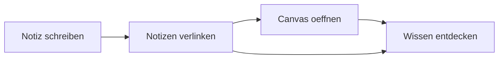

# Markdown Showcase

Diese Notiz zeigt dir, was alles mit Markdown in MindGraph moeglich ist. Siehe auch [[01 - Erste Schritte]] fuer die Grundlagen.

## Textformatierung

**Fett**, *kursiv*, ~~durchgestrichen~~, ==hervorgehoben==, `Code`

## Tabellen

| Feature | Beschreibung | Status |
|---------|-------------|--------|
| Wikilinks | Notizen verlinken | Aktiv |
| Canvas | Wissensgraph | Aktiv |
| Flashcards | Spaced Repetition | Aktiv |
| Lokale KI | Ollama/LM Studio | Optional |

## Callouts

> [!note] Hinweis
> Callouts sind farbige Info-Boxen fuer wichtige Informationen.

> [!tip] Tipp
> Du kannst Callouts mit `> [!typ]` erstellen. Typen: note, tip, warning, info, question.

> [!warning] Achtung
> Callouts koennen auch eingeklappt werden.

## Aufgaben

- [x] MindGraph installieren
- [x] Willkommens-Notiz lesen
- [ ] Erste eigene Notiz erstellen
- [ ] Zwei Notizen verlinken
- [ ] Canvas ausprobieren

## Code

```python
# MindGraph unterstuetzt Syntax-Highlighting
def wissensnetz():
    notizen = ["Idee A", "Idee B", "Idee C"]
    for notiz in notizen:
        print(f"Verlinke: [[{notiz}]]")
```

## Mathematik (LaTeX)

Inline: $E = mc^2$

Block:
$$
\int_{0}^{\infty} e^{-x^2} dx = \frac{\sqrt{\pi}}{2}
$$

## Mermaid-Diagramme



## Fussnoten

MindGraph unterstuetzt Fussnoten[^1] fuer akademisches Schreiben[^2].

[^1]: Fussnoten erscheinen am Ende der Notiz.
[^2]: Perfekt fuer wissenschaftliche Arbeiten, siehe auch [[Zotero Beispiel]].

---

Zurueck zum [[Wissensnetz]]
