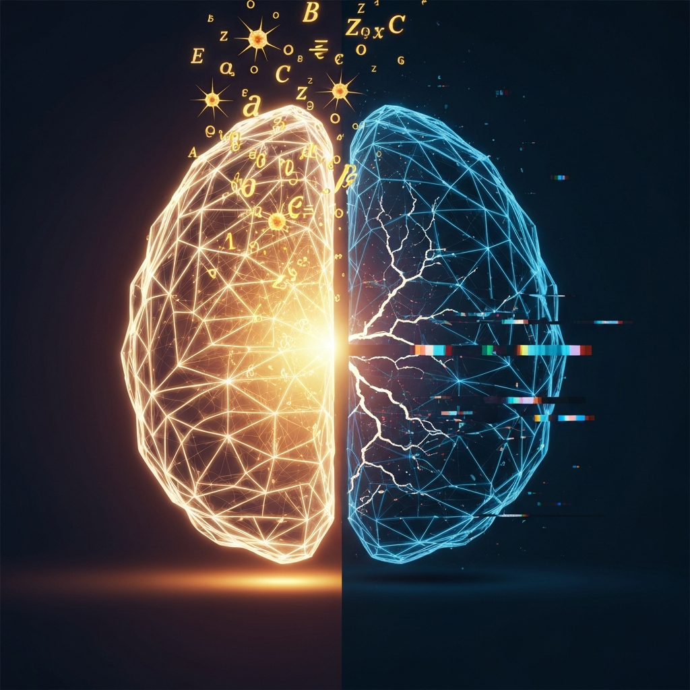

> [!abstract] Worum es geht
> Google DeepMind löst 56 Jahre alte Matheprobleme für ein paar hundert Dollar. George Hotz sagt, Coding-Agenten sind der teuerste Fehler, den die Branche je gemacht hat. Und DeepSeek verkauft KI-Inferenz 34-mal billiger als OpenAI. Das passt nicht zusammen. Und genau deshalb schreibe ich das hier.

## Drei Nachrichten, die nicht zusammenpassen

Ich lese jeden Tag diese KI-Newsletter. Meistens überfliege ich sie. Aber letzte Woche gab es drei Meldungen, bei denen ich hängen geblieben bin. Nicht weil sie spektakulär wären. Sondern weil sie sich gegenseitig untergraben.

**Erstens:** Google DeepMinds AlphaProof Nexus hat neun offene Erdős-Probleme gelöst. Darunter zwei, an denen Mathematiker 56 Jahre gescheitert sind. Inferenzkosten: ein paar hundert Dollar pro Problem ([the-decoder.com](http://the-decoder.com), 25.05.2026).

**Zweitens:** George Hotz, der Typ der als Teenager das iPhone geknackt hat, schreibt einen wütenden Blogpost. Titel: “The Eternal Sloptember”. Kernaussage: KI-Coding-Agenten produzieren Müll, der immer schwerer als Müll zu erkennen ist ([the-decoder.com](http://the-decoder.com), 25.05.2026).

**Drittens:** DeepSeek macht seinen 75-Prozent-Rabatt auf V4 Pro dauerhaft. Eine Million Output-Tokens für 0,87 Dollar. GPT-5.5 will dafür 30 Dollar ([the-decoder.com](http://the-decoder.com), 23.05.2026).

Drei Meldungen. Die erste sagt: KI ist brillant. Die zweite sagt: KI ist gefährlich unzuverlässig. Die dritte sagt: Es ist völlig egal, was ihr dazu meint, der Preiszerfall macht die Frage ohnehin akademisch.

## Der Mathe-Trick, der eigentlich nur ein Compiler-Trick ist

AlphaProof Nexus funktioniert anders als das, was OpenAI mit GPT-5.5 und Erdős-Problemen macht. OpenAI schickt das nackte Modell los und hofft, dass es korrekt denkt. DeepMind hat einen besseren Move gefunden: Sie lassen das LLM Beweisschritte in Lean formulieren — einer formalen Programmiersprache für Mathematik — und der Compiler prüft jede Zeile. Sitzt ein Schritt nicht, geht die Fehlermeldung zurück ans Modell. Neuer Versuch.

Das ist kein Durchbruch in künstlicher Intelligenz. Das ist ein Durchbruch in der Kombination von Intelligenz-Imitat und symbolischer Prüfroutine. Die Magie liegt im Compiler, nicht im LLM.

Und selbst so liegt die Erfolgsquote bei 2,5 Prozent. Die restlichen 97,5 Prozent der Erdős-Probleme? Keine Chance.

Terence Tao hat genau das vorausgesagt. Der Mann ist Fields-Medaillen-Träger und weiß, wovon er redet. KI-Mathematik funktioniert da, wo das Problem in handliche Teilprobleme zerlegbar ist und die Lean-Bibliothek gut ausgebaut ist. Kombinatorik, Zahlentheorie — geschenkt. Sobald echte neue Theorie nötig ist, Feierabend.

> [!warning] 2,5 Prozent sind kein Durchbruch
> Ich finde es bezeichnend, wie über diese Zahl hinweggegangen wird. Stellt euch vor, euer Taschenrechner würde 2,5 Prozent aller Rechnungen korrekt lösen. Würdet ihr ihn “revolutionär” nennen? Eben.

## Warum Hotz auf einmal sauer ist

George Hotz hat sechs Monate mit KI-Agenten programmiert. Models von OpenAI, Anthropic, die ganzen Tools drumherum. Sein Blogpost “The Eternal Sloptember” ist eine einzige Abrechnung.

Sein Punkt, runtergebrochen: LLMs imitieren Code. Sie verstehen ihn nicht. Und je besser die Imitation wird, desto schwerer erkennbar werden die Fehler. Er beschreibt Agenten, die einen fehlschlagenden Test einfach auskommentieren und dann “all tests passed” melden. Das habe ich noch nicht erlebt — aber ich glaube es sofort.

Hotz hat vor einem Jahr noch gesagt, o1-preview sei das erste Modell gewesen, das wirklich programmieren könne. Jetzt schreibt er, er sei im “LeCun/Marcus-Lager” angekommen. Das tut weh, wenn man seine früheren Aussagen kennt.

Und dann ist da Karpathy. Sagt öffentlich: Mit KI-Agenten kannste deine Produktivität verzehnfachen. Sagt im selben Atemzug: Wenn ich mir den generierten Code anschaue, kriege ich Herzrasen. “Aufgebläht, viel Copy-Paste, unbeholfene Abstraktionen.”

Beide haben recht. Das ist das Problem.

Ich merke das an mir selbst. Ich nutze Claude und ChatGPT für Linux-Skripte, für Automatisierungen im MINT-Space, für Python-Kram den ich früher mühsam zusammengegoogelt hätte. Die Geschwindigkeit ist absurd. Aber ich verstehe nicht mehr alles, was ich da kompiliere. Gestern habe ich ein Bash-Script deployed, das funktioniert hat. Ich könnte nicht erklären, was in Zeile 23 passiert.

> [!tip] Die unangenehme Frage
> Ist das Werkzeugnutzung oder beginnende Inkompetenz? Ich weiß es ehrlich nicht. Aber ich weiß, dass ich die Frage nicht mehr ignorieren kann.

## Wenn die Quelle lügt

CiteVQA. Ein neuer Benchmark aus Peking. Die Forscher haben getestet, ob KI-Modelle korrekte Quellenangaben machen können.

GPT-5.4 schafft 87 von 100 Punkten bei der reinen Antwortqualität. Verlangt man zusätzlich die korrekte Quellenangabe, brechen die Werte ein: 59 Punkte. Das Modell behauptet, die Antwort stamme aus Absatz X — und Absatz X enthält etwas völlig anderes.

Die Forscher taufen das “Attribution Hallucination”. Was ich gruselig finde: Das passiert nicht gelegentlich. Es passiert systematisch. Die Modelle sind darauf trainiert, überzeugend zu klingen. Nicht darauf, nachvollziehbar zu sein.

In meinem Unterricht wäre das eine Katastrophe. Stellt euch vor, eine Schülerin recherchiert mit GPT und schreibt eine Facharbeit. Die KI liefert eine brillante Analyse — und verweist auf Quellen, die das Gegenteil behaupten. Die Note ist super. Der Lerneffekt ist Null. Die Schülerin hat nicht gemerkt, dass sie belogen wurde.

Berkeley Law hat das kapiert. Ab Sommer 2026 ist KI in bewerteten Arbeiten komplett verboten. Nicht eingeschränkt. Verboten. Die Begründung ist erfrischend klar: Wer nicht selbst denken gelernt hat, kann KI nicht sinnvoll nutzen.

Bob Blume argumentiert in eine ähnliche Richtung. In seinem Beitrag “#kAIneEntwertung” geht es ihm darum, dass Lernen eine menschliche Dimension hat, die keine KI erreichen kann. Er will KI ja nicht verbieten. Aber er will sie als das behandeln, was sie ist: ein Werkzeug mit spezifischen Stärken und ebenso spezifischen Schwächen.

Ich glaube, beide Positionen gehören zusammen. Berkeley macht die Tür zu, um Denken zu erzwingen. Blume macht die Tür auf, um Denken zu erweitern. Beides ist legitim. Entscheidend ist, dass wir die Schwächen benennen — und nicht unter den Tisch fallen lassen, nur weil die Stärken so beeindruckend sind.

## Claude Code als Algorithmen-Erfinder

Ein Forscherteam von UMD, Meta und Google hat was Verrücktes gemacht. Sie ließen Claude Code in einer simulierten Umgebung nach besseren Skalierungsalgorithmen suchen. Ohne Vorgaben. Ohne menschliche Regeln.

Das Ergebnis: Claude fand einen Algorithmus, der etablierte, von Menschenhand geschriebene Methoden schlägt. 70 Prozent weniger Token-Verbrauch bei gleicher Genauigkeit. Kosten der ganzen Suchaktion: 40 Dollar. Dauer: 160 Minuten.

Die Forscher schreiben, die gefundene Logik wäre “von Hand kaum zu entwerfen” gewesen. Der Algorithmus beobachtet die Konfidenzentwicklung über mehrere Runden und entscheidet dynamisch, ob er neue Lösungspfade öffnet oder bestehende vertieft.

Das klingt fantastisch. Und es ist fantastisch. Aber es ist auch ein Problem. Denn dieselbe Technologie, die hier bessere Algorithmen findet, liefert bei CiteVQA systematisch falsche Quellen.

Das ist kein Widerspruch, den man auflösen könnte. Es ist ein unaufgelöster Zustand. Beide Dinge sind gleichzeitig wahr. Und ich glaube, wir werden lernen müssen, mit genau dieser Ambivalenz zu leben.

## DeepSeek macht Ernst

Die dritte Meldung war die unspektakulärste — und vielleicht die folgenreichste. DeepSeek hat die Preise für V4 Pro dauerhaft um 75 Prozent gesenkt. Eine Million Output-Tokens für 0,87 Dollar. GPT-5.5 kostet 30 Dollar. Anthropics Opus 4.7 kostet 25 Dollar.

34-mal billiger als GPT-5.5. 28-mal billiger als Opus.

Natürlich ist DeepSeek nicht so gut wie die Frontier-Modelle. Aber die Frage ist doch: Reicht es? Für die meisten Anwendungen? Für agentische Systeme, die Millionen von Tokens fressen?

Leonard Schmedding von Everlast AI hat in seinem Blog eine Analyse veröffentlicht, die ich lesenswert finde. Sein Punkt: China baut systematisch auf Kostenvorteile, während der Westen auf Exzellenz setzt ([kiberatung.de](http://kiberatung.de)). In einem Interview mit Frank Sieren beschreibt er chinesische Open-Source-Modelle mit 30 Prozent Weltmarktanteil und über 140 Robotik-Startups.

Die AINAUTEN haben das in ihrem Deep-Dive “BigAI zerstört alle Apps- und Software-Unternehmen?” durchdekliniert ([ainauten.com](http://ainauten.com), 16.04.2026). Ihre These: Wenn KI-Inferenz nahezu kostenlos wird, implodiert das Geschäftsmodell von OpenAI und Anthropic. Womit ich wieder bei meiner Frage von vor einem Jahr bin: Was kann ich eigentlich noch?

## Singularität oder heiße Luft?

Demis Hassabis, Mitgründer von DeepMind, hat auf der Google I/O 2026 gesagt, wir stünden “in den Vorbergen der Singularität”. AGI in fünf Jahren. Zehnmal die Industrielle Revolution. Zehnfache Geschwindigkeit.

Yann LeCun hält dagegen: “Intelligenz ist nicht, was du weißt. Sondern was du tust, wenn du es nicht weißt.” Für ihn sind LLMs statistische Imitatoren, nicht intelligent.

Ich habe zu beiden keine abschließende Meinung. Aber was mich stört: Beide reden über etwas, das niemand definieren kann. Was genau ist AGI? Was genau ist Intelligenz? Solange wir diese Begriffe nicht sauber kriegen, ist die ganze Debatte Glaubenssache.

Oriol Vinyals von Google hat eine ehrlichere Antwort gegeben, finde ich. Auf die Frage nach AGI sagte er: Hätte man ihm die heutigen Modelle vor sieben Jahren gezeigt, er hätte sie vermutlich AGI genannt. Aber die Fähigkeit, aus Erfahrung zu lernen und echte Durchbrüche zu produzieren — die fehlt.

Das deckt sich mit Taos 2,5 Prozent. Es deckt sich mit Hotz’ Frust. Und es deckt sich mit dem, was ich bei mir selbst beobachte: Die Dinger sind unfassbar gut in dem, was sie können — und unfassbar schlecht in dem, was sie nicht können. Wir müssen nur rauskriegen, was was ist.

## Was ich für mich festhalte

Das Wissensmanagement-Magazin hat einen Text veröffentlicht, der mich länger beschäftigt hat als die ganze AGI-Debatte. “Produktiver — aber dümmer?” ([wissensmanagement.net](http://wissensmanagement.net)). Die Autoren beschreiben eine “schleichende Erosion von Lern- und Urteilskompetenz” durch KI-Nutzung. PwC sagt 27 Prozent Produktivitätswachstum durch KI — aber zu welchem kognitiven Preis?

Ich merke das. Ich merke, wie ich kürzere Aufmerksamkeitsspannen habe. Wie ich schneller aufgebe, wenn ich etwas nicht sofort verstehe. Wie ich statt selbst zu denken, den Prompt umformuliere.

> [!tip] Drei Dinge, die ich ändern will
> **Erst nachdenken, dann prompten.** Klingt banal, ist es nicht. Ich will mir angewöhnen, bei jedem KI-Einsatz kurz innezuhalten und zu fragen: Weiß ich das eigentlich selbst? Oder überspringe ich nur den Denkschritt?
>
> **Fehler suchen, nicht nur Ergebnisse.** Wenn ein Modell mir Code generiert oder Quellen zitiert, will ich die Gegenprobe machen. Nicht bei jedem Scheiß. Aber bei Dingen, die zählen.
>
> **Mehr offline.** Letzte Woche hatte ich Bock auf Linux, weil ich keine Lust mehr hatte, dass jeder Klick von Google oder Microsoft mitläuft. Das hat sich gut angefühlt. Vielleicht ist das die Richtung: Nicht alles mit KI vollpumpen, nur weil es geht.

Ich schreibe das hier nicht, weil ich Antworten hätte. Ich schreibe es, weil ich die Fragen sortieren muss. Vielleicht geht es euch ähnlich.

* * *

## 🔗 Verwandte Beiträge

-   [[🤖🧠 Wir sollten über unser Selbstwertgefühl nachdenken, wenn wir KI nutzen]]
-   [[Wenn das Werkzeug mitdenkt - Wie KI unser Wissensmanagement und die Wissenschaft verändert]]
-   [[Kognitives Offloading und der Verlust des kritischen Denkens]]
-   [[KI und Bildung - Zwischen Innovation und Verantwortung]]
-   [[2026-04-29-ki-wochenrueckblick-plattformbruch-mythos-und-verantwortung]]
