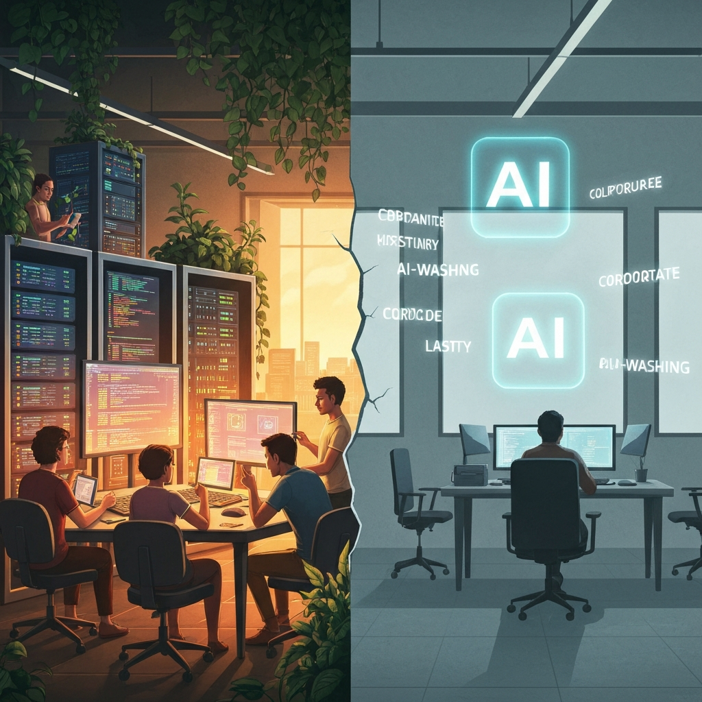

> [!abstract] Zusammenfassung
> Die Tech-Welt spaltet sich: Auf der einen Seite feiern wir Open-Source-Projekte wie Ageless Linux und GIMP 3.2, auf der anderen entlarvt Spotifys AI DJ die Hohlheit vieler KI-Features. Ein persönlicher Blick auf einen Tag, der zeigt, wohin die Reise geht.

## Ein ganz normaler Tag in der Tech-Welt

Manchmal reicht ein einziger Tag, um zu verstehen, in welche Richtung sich die Technologiewelt bewegt. Der 15. März 2026 ist so ein Tag. Wenn ich morgens meine Nachrichtenquellen durchscrolle — Hacker News, Heise, die üblichen Verdächtigen — dann sehe ich zwei Welten, die nebeneinander existieren und sich zunehmend voneinander entfernen.

Auf der einen Seite: Menschen, die Software bauen, weil sie an etwas glauben. Auf der anderen: Konzerne, die KI auf alles kleben, was nicht bei drei auf dem Baum ist. Und dazwischen stehen wir und müssen entscheiden, was davon unser Leben tatsächlich besser macht.

## Die stille Revolution der Open-Source-Welt

Die meistdiskutierte Story des Tages auf Hacker News heißt **Ageless Linux** — über 650 Punkte, mehr als 400 Kommentare. Ein Linux-Projekt, das sich einer simplen, aber radikalen Idee verschrieben hat: Software soll von Menschen jeden Alters nutzbar sein. Keine Altersgrenzen, keine Barrieren. Barrierefreiheit nicht als Fußnote, sondern als Designprinzip.

Das hat mich berührt. Nicht, weil es technisch revolutionär wäre, sondern weil es zeigt, dass in der Open-Source-Gemeinschaft immer noch Menschen sitzen, die sich fragen: **Für wen bauen wir das eigentlich?** Diese Frage wird viel zu selten gestellt.

Daneben hat **GIMP 3.2** das Licht der Welt erblickt — mit nicht-destruktiven Ebenen und Vektor-Export. Für alle, die seit Jahren darauf warten, dass die Open-Source-Alternative zu Photoshop erwachsen wird: Es passiert. Langsam, aber es passiert. Und das ganz ohne Abo-Modell und Cloud-Zwang.

Und dann ist da **Han**, eine koreanische Programmiersprache, geschrieben in Rust. Fast 180 Punkte auf Hacker News. Eine Programmiersprache, die nicht auf Englisch basiert — das klingt wie eine Kleinigkeit, ist aber ein Statement. Code ist Sprache, und Sprache ist Kultur. Warum sollte die Welt des Programmierens nur auf Englisch denken?

## Wenn KI zur Farce wird

Auf der anderen Seite des Spektrums steht **Spotifys AI DJ**. Charles Petzold hat sich die Mühe gemacht, das Feature auseinanderzunehmen, und sein Urteil ist vernichtend: Der KI-DJ versteht Musik nicht. Er versteht keine Zusammenhänge, keine Stimmungen, keine Übergänge. Er simuliert Verständnis, wo keines ist.

Das ist für mich der Kern dessen, was ich zunehmend als **KI-Washing** wahrnehme. Unternehmen stecken KI in ihre Produkte, nicht weil sie das Nutzererlebnis verbessert, sondern weil es sich gut vermarkten lässt. KI als Etikett, nicht als echte Innovation. Und wir als Nutzer sollen beeindruckt sein — sind es aber immer seltener.

Ich denke, die Branche steht an einem Wendepunkt. Die Toleranz für hohle KI-Versprechen sinkt. Menschen merken, wenn KI nur aufgesetzt ist, wenn sie stört statt hilft, wenn sie Komplexität vortäuscht, wo Einfachheit gefragt wäre.

## Das Rennen der Giganten

Dazwischen tobt das Wettrüsten. **Google kauft Wiz für 32 Milliarden Dollar** — die größte Übernahme in der Geschichte des Unternehmens. Eine Cloud-Sicherheitsfirma. Das sagt viel darüber aus, wo die Zukunft der Tech-Industrie liegt: nicht in neuen Features, sondern im Schutz dessen, was bereits da ist.

Gleichzeitig bringt **Alibaba seine Qwen 3.5-Modellfamilie** heraus — mehrere multimodale Sprachmodelle in verschiedenen Größen. China lässt nicht locker. Das KI-Wettrüsten ist längst keine westliche Angelegenheit mehr, und die Geschwindigkeit, mit der neue Modelle auf den Markt kommen, ist atemberaubend und beunruhigend zugleich.

## Das E-Evidence-Gesetz: Wenn der Staat schneller wird als du denkst

Fast untergegangen in der Nachrichtenflut: Das **E-Evidence-Gesetz** der EU tritt in Kraft. Cloud-Anbieter müssen jetzt innerhalb von Stunden auf Datenanfragen von Strafverfolgungsbehörden reagieren. Nicht Tage, nicht Wochen — Stunden.

Das ist ein massiver Eingriff. Und ich bin unsicher, wie ich darüber denke. Einerseits verstehe ich die Notwendigkeit schneller Ermittlungen in einer digitalen Welt. Andererseits frage ich mich: Wie viel Geschwindigkeit verträgt der Datenschutz? Wenn Behörden in Stunden Zugriff auf Cloud-Daten bekommen, wer stellt sicher, dass die Verhältnismäßigkeit gewahrt bleibt?

## Was wirklich zählt

Wenn ich den Tag Revue passieren lasse, dann sehe ich ein Muster. Die Geschichten, die mich wirklich begeistern, sind nicht die der Milliarden-Übernahmen oder der neuen Modellgenerationen. Es sind die Geschichten von Menschen, die Hydroponik-Systeme in Serverracks bauen, die Programmiersprachen in ihrer Muttersprache erfinden, die Linux für alle zugänglich machen wollen.

Es sind die Geschichten von echtem Fortschritt — nicht gemessen in Parametern oder Marktkapitalisierung, sondern in der schlichten Frage: **Macht das die Welt ein kleines bisschen besser?**

Die Hälfte der heutigen Tech-News ist positiv. Ein Fünftel ist besorgniserregend. Der Rest ist neutral, informativ, technisch. Aber die Tendenz ist klar: Die Tech-Welt spaltet sich in diejenigen, die bauen, weil sie es können, und diejenigen, die bauen, weil sie müssen — weil der Markt es verlangt, weil die Investoren es erwarten, weil KI gerade das Buzzword der Stunde ist.

## Fazit

Ich wünsche mir mehr Ageless Linux und weniger AI DJs. Mehr Han und weniger KI-Washing. Mehr Menschen, die sich fragen, für wen sie Software bauen — und weniger, die sich fragen, wie sie KI in ihr nächstes Pitch Deck bekommen.

Die Technologie ist nicht das Problem. Sie war es nie. Die Frage ist und bleibt: **Was machen wir daraus?** Und an Tagen wie heute habe ich das Gefühl, dass genug Menschen die richtige Antwort auf diese Frage suchen.

---

## 🔗 Verwandte Beiträge

- [[🤖🧠 Wir sollten über unser Selbstwertgefühl nachdenken]]
- [[🤖🔍 Wenn Ki Nutzung zur Gewohnheit wird]]
- [[🤖💭 Meine Sichtweise auf LLM Modelle und AI]]
