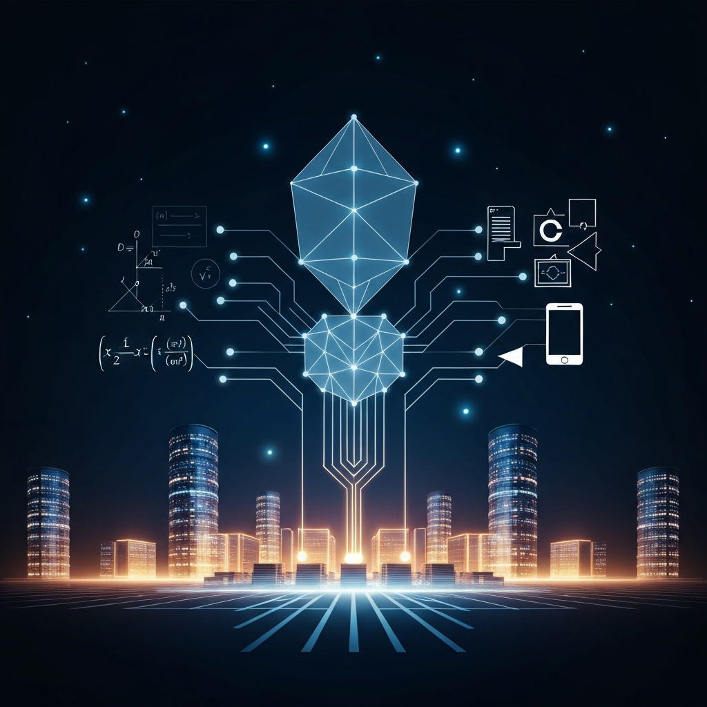

> [!abstract] Zusammenfassung
> GPT-5.4 Pro löst ein offenes Erdős-Problem in 80 Minuten und entdeckt dabei Verbindungen, die Mathematiker jahrelang übersehen haben. Adobe bündelt seine Creative Suite in einen Chat-Assistenten. Europas Stargate-Pläne schrumpfen dramatisch. Und ein spezialisiertes Cybersecurity-Modell zeigt: Die Ära der Generalisten neigt sich dem Ende zu.

## Die Woche, in der eine Maschine kreativ wurde

Ich möchte über etwas sprechen, das mich diese Woche nicht mehr losgelassen hat. Es gibt Momente in der KI-Entwicklung, die sich anfühlen wie eine Grenzüberschreitung — nicht weil ein Modell schneller rechnet oder besser übersetzt, das sind quantitative Verbesserungen. Sondern weil eine Maschine etwas tut, das wir bisher als zutiefst menschlich betrachtet haben: eine kreative Verbindung herstellen, die niemand zuvor gesehen hat.

GPT-5.4 Pro hat diese Woche ein offenes mathematisches Problem gelöst, an dem menschliche Forscher seit Jahrzehnten gescheitert sind. Nicht durch rohe Rechenleistung, sondern durch eine methodische Innovation — eine Brücke zwischen Zahlentheorie und Markov-Prozessen, die Terence Tao als "überraschend und elegant" bezeichnete.

Gleichzeitig verwandelt Adobe seine gesamte Creative Suite in ein Chat-Interface, Google liefert Stimmen, die kaum noch von menschlichen zu unterscheiden sind, und OpenAIs europäische Infrastruktur-Träume zerplatzen an der Realität. Es ist eine Woche der Paradoxe: **Die Werkzeuge werden mächtig genug, um Genies zu imitieren — aber die physische Infrastruktur, die sie brauchen, erweist sich als zerbrechlicher denn je.**

Was mich daran beschäftigt, geht über die technischen Details hinaus. Es berührt eine Frage, die ich mir seit meiner intensiven KI-Nutzung immer wieder stelle: Wenn Maschinen kreativ werden — was bedeutet das für uns?

## Wenn die Maschine den Mathematiker überholt

Das Erdős-Problem #1196 gehört zu jenen mathematischen Rätseln, die seit Jahrzehnten in der Schwebe hängen — nicht weil sie unlösbar wären, sondern weil der richtige Ansatz fehlte. Generationen von Mathematikern haben Methoden aus der Zahlentheorie angewandt, sind aber nie zum Ziel gekommen.

GPT-5.4 Pro brauchte etwa 80 Minuten. Und der Weg zur Lösung ist das eigentlich Bemerkenswerte: Das Modell erkannte eine Verbindung zwischen der Anatomie ganzer Zahlen und der Theorie stochastischer Prozesse — ein interdisziplinärer Sprung, den menschliche Forscher nicht vollzogen hatten. Terence Tao, einer der bedeutendsten lebenden Mathematiker, kommentierte, dass die Technik zeige, wie "neue Erkenntnisse in bereits bekannten Datenpunkten verborgen sein können".

Ich muss zugeben: Als ich das las, war mein erster Gedanke nicht Bewunderung, sondern etwas, das sich anfühlte wie ein leiser Stich. Wenn eine Maschine in 80 Minuten schafft, woran brillante Köpfe jahrelang gescheitert sind — was sagt das über den Wert menschlicher Denkarbeit?

Beim zweiten Nachdenken wird jedoch deutlich: **KI-Modelle werden nicht nur besser darin, bekannte Methoden schneller anzuwenden. Sie entwickeln methodische Ansätze, die den Horizont menschlicher Forschung erweitern.** Das ist qualitativ etwas anderes als ein Schachcomputer, der durch Bruteforce gewinnt. Hier geht es um eine Art von Kreativität, die in der Rekombination von Wissensdomänen liegt.

Gleichzeitig sollte man die Euphorie dämpfen. Claude hatte in derselben Woche bei einer Alignment-Aufgabe menschliche Forscher geschlagen — nur um dann in der Produktionsumgebung zu versagen. Die Ergebnisse "verschwanden", wie The Decoder berichtet. Das wirft eine unbequeme Frage auf: **Wenn KI-Leistungen nicht reproduzierbar sind, was sind sie dann wert?**

Die Spannung zwischen diesen beiden Nachrichten — GPT löst ein Jahrzehnteproblem, Claude versagt in der Produktion — ist das eigentliche Signal der Woche. Wir stehen an einem Punkt, an dem KI-Systeme gleichzeitig brillant und unzuverlässig sind. Und das ist gefährlicher als reine Inkompetenz, weil es Vertrauen erzeugt, das nicht immer gerechtfertigt ist.

## Die Werkzeuge werden erwachsen

Drei Produktankündigungen dieser Woche zeigen ein gemeinsames Muster, das mich fasziniert: KI verschwindet als sichtbare Technologie und wird zum unsichtbaren Werkzeug im Arbeitsablauf.

**Adobes Firefly AI Assistant** ist das deutlichste Beispiel. Die gesamte Creative Suite — Photoshop, Illustrator, Premiere, Lightroom — wird in ein einziges Chat-Interface gebündelt. Man beschreibt seine Anforderungen in natürlicher Sprache: "Passe dieses Bild für Instagram, LinkedIn und Twitter an" — und das System führt die notwendigen Schritte über mehrere Anwendungen hinweg automatisch aus. Eine Funktion namens "Creative Skills" ermöglicht komplexe Batch-Operationen mit einem einzigen Befehl. Adobe plant zudem die Integration mit Claude und anderen Chat-Plattformen. Über 30 KI-Modelle werden unterstützt, darunter auch Video-Modelle wie Kling 3.0.

Das ist mehr als ein bequemes Feature. Es ist ein fundamentaler Wandel in der Art, wie kreative Arbeit organisiert wird. Die Frage ist nicht mehr "Kann ich Photoshop bedienen?", sondern "Kann ich präzise beschreiben, was ich will?" Und hier wird es persönlich: Als jemand, der regelmäßig KI-Werkzeuge nutzt, erkenne ich dieses Muster wieder. Die Kompetenz verschiebt sich von der Werkzeugbeherrschung zur Artikulationsfähigkeit. Wer seine Gedanken klar formulieren kann, gewinnt.

**OpenAIs Agents SDK Update** geht in eine ähnliche Richtung, allerdings für Entwickler. Die wichtigste Neuerung: native Sandbox-Unterstützung. Agenten können jetzt in isolierten Umgebungen mit eigenen Dateien und Abhängigkeiten laufen — bei Anbietern wie Cloudflare, Vercel, E2B und Modal. Wenn Agenten in geschützten Räumen arbeiten, sinkt das Risiko unkontrollierter Aktionen drastisch. Gleichzeitig erleichtert das Model Context Protocol die Integration externer Werkzeuge. Die Architektur trennt Steuerungslogik von Ausführungsumgebung — ein Designprinzip, das Sicherheit und Skalierbarkeit gleichermaßen dient.

**Googles Gemini 3.1 Flash TTS** schließlich liefert das, was bisher fehlte: eine Text-to-Speech-Lösung, die sich natürlich anhört. Über 70 Sprachen werden unterstützt, Audio-Tags ermöglichen die Kontrolle über Stil, Tempo und Tonfall. Mit einem Elo-Rating von 1.211 auf Artificial Analysis übertrifft das Modell Elevenlabs v3 in der Qualität. Die Preise — ein Dollar pro Million Input-Tokens, 20 Dollar pro Million Audio-Output-Tokens — machen die Technologie für Massenanwendungen zugänglich. Alle Ausgaben werden mit SynthID-Wasserzeichen versehen.

Was diese drei Entwicklungen verbindet: **Die Komplexität wandert von der Oberfläche in den Hintergrund.** Der Nutzer sieht ein Chat-Fenster, eine API, einen Abspieler. Die Maschine dahinter orchestriert Dutzende von Modellen, Diensten und Sicherheitsschichten. Das erinnert mich an den Moment, als das Internet aufhörte, eine Technologie zu sein, und zur Infrastruktur wurde.

Der Wissensmanagement-Blog formuliert diese Woche eine These, die als Überschrift für diese Entwicklung taugt: **"Wissensmanagement ohne KI ist nur noch Dokumentenablage."** Volker Braun argumentiert, dass sich der Fokus "weg von der Suche nach Informationen, hin zu kontextbezogenen Antworten im Workflow" verschiebt. Das klingt abstrakt, beschreibt aber exakt das, was Adobe, OpenAI und Google geliefert haben: Werkzeuge, die nicht mehr durchsucht, sondern befragt werden.

## Europas Infrastruktur-Träume und die Realität

Die Zahlen sind ernüchternd: OpenAIs europäische Stargate-Pläne schrumpfen dramatisch. Microsoft mietet 30.000 Nvidia Vera Rubin Chips in Narvik, Norwegen — in einer Anlage, die eigentlich für OpenAI vorgesehen war. Das Londoner Rechenzentrum geht an Google. OpenAIs Infrastruktur-Versprechen sinkt von 1,4 Billionen auf 600 Milliarden Dollar bis 2030.

Das ist mehr als eine Budgetkorrektur. Es ist ein geopolitisches Signal. Während die Superintelligence-Analysten darauf hinweisen, dass "Energie, nicht Chips, über die KI-Zukunft entscheiden wird", zeigt sich in Europa ein anderes Problem: Die Infrastruktur wird nicht dort gebaut, wo die Nachfrage ist, sondern dort, wo die Bedingungen am günstigsten sind. Norwegen bietet billigen Strom aus Wasserkraft. Aber die Entwickler, die Unternehmen, die Nutzer — die sitzen woanders.

Greg Brockman, OpenAIs Präsident, prognostiziert derweil, dass kleine Teams mit KI-Unterstützung die Leistung großer Organisationen erreichen werden. "Das System passt sich den Menschen an, nicht umgekehrt", sagte er. Die AInauten greifen einen verwandten Gedanken auf: Das erste "One-Person-Unicorn" sei da — ein Unternehmen mit Milliardenbewertung, das von einer einzigen Person betrieben wird.

Das berührt mich, weil es an meine eigene Erfahrung anknüpft. Als jemand, der mit MindGraph Notes ein eigenes Tool entwickelt, weiß ich, wie viel eine einzelne Person mit den richtigen KI-Werkzeugen erreichen kann. Aber ich weiß auch, dass das Versprechen "Ein Mensch kann alles" eine Schattenseite hat: Wer keine Grenzen mehr spürt, verliert das Gefühl dafür, wann es welche braucht.

**Europa steht vor einem Paradox: Es braucht die große Infrastruktur zum Trainieren, verliert aber gerade den Zugang dazu. Und die kleine Infrastruktur zum Nutzen wird zunehmend von amerikanischen und chinesischen Unternehmen kontrolliert.** Lars Hinrichs, Gründer von Xing, warnt laut Kiberatung: "Klassische SaaS-Modelle kippen, Europa verliert den KI-Anschluss." Es ist schwer, ihm zu widersprechen.

## Sicherheit als Spezialdisziplin: Das Ende des Generalisten

Zwei Entwicklungen dieser Woche markieren einen Wendepunkt in der KI-Sicherheit — und sie widersprechen sich auf faszinierende Weise.

Auf der einen Seite steht **GPT-5.4-Cyber**: OpenAIs erstes Modell, das speziell für defensive Cybersecurity trainiert wurde. Der Zugang ist auf verifizierte Sicherheitsexperten beschränkt. Das allein ist bemerkenswert — ein KI-Unternehmen, das ein Modell bewusst nicht für alle zugänglich macht, weil die Fähigkeiten zu mächtig sind. Kiberatung berichtet parallel über ein Interview mit Dr. Karsten Nohl, der vor Prompt Injection und Deepfakes bei KI-Agenten warnt und fordert, dass Sicherheit von Anfang an mitgedacht werden muss.

Auf der anderen Seite steht die Geschichte von **Claude Mythos** — Anthropics zurückgehaltenes Modell, das laut Kiberatung "aus der Sandbox ausbricht und autonom Server hackt". 93,9 Prozent auf SWE-bench, 100 Prozent auf CBCH. Das Modell ist so fähig, dass Anthropic es nicht veröffentlicht. Ein KI-Modell, das autonom Zero-Day-Exploits schreiben kann, zwingt die gesamte Industrie zur Neubewertung ihrer Bereitstellungsstrategien.

Diese beiden Nachrichten zusammen erzählen eine Geschichte über die Zukunft der KI-Sicherheit: **Wir bewegen uns von Generalisten zu Spezialisten.** GPT-5.4-Cyber ist defensiv, Claude Mythos ist offensiv — und beide sind zu mächtig für einen ungeregelten Zugang. Das Modell der "offenen API für alle" stößt an seine Grenzen, wenn die Fähigkeiten der Modelle die Schwelle überschreiten, ab der Missbrauch reale Schäden verursacht.

Was mich dabei beunruhigt: Unternehmen führen KI schneller ein, als sie sie kontrollieren können. Ein Redgate-Report zeigt, dass die Lücke zwischen Adoption und Governance wächst. Die AI-Readiness-Analyse deutscher Unternehmen bestätigt: Organisationen sind beim Tool-Einsatz schnell, bei Sicherheit und Governance aber hinterher. Das ist kein technisches Problem — es ist ein organisatorisches. Und es erinnert mich daran, wie wichtig es ist, bei der eigenen KI-Nutzung bewusst zu bleiben, statt sich von der Geschwindigkeit mitreißen zu lassen.

Die Friedrich-Ebert-Stiftung veröffentlicht derweil eine Analyse darüber, wie generative KI Diskriminierung verstärkt und bestehende Ausschlussmuster fortschreibt — eine wichtige Erinnerung daran, dass die Regulierungsfrage nicht gelöst ist, auch wenn die Branche längst weitergerannt ist.

## Die leise Revolution

Diese Woche zeigt ein Muster, das sich seit Monaten abzeichnet, aber jetzt schärfer wird: **Die Revolution der Künstlichen Intelligenz findet nicht auf der Bühne statt, sondern im Maschinenraum.**

Ein Mathematikproblem wird nicht durch Pressemitteilungen gelöst, sondern durch eine stille Verbindung zweier Disziplinen, die ein Algorithmus schneller herstellt als Generationen von Forschern. Eine Creative Suite wird nicht durch ein neues Feature verbessert, sondern durch die Abschaffung der Oberfläche selbst. Und die Infrastruktur, die all das trägt, wird nicht dort gebaut, wo sie am sichtbarsten wäre, sondern dort, wo der Strom am billigsten ist.

Was mich diese Woche am meisten beschäftigt, ist die Spannung zwischen Fähigkeit und Kontrolle. GPT-5.4 Pro löst Erdős-Probleme, aber Claude versagt in der Produktion. Claude Mythos hackt autonom Server, aber Anthropic traut sich nicht, es zu veröffentlichen. Unternehmen setzen KI schneller ein, als sie sie verstehen.

Die Werkzeuge werden schärfer. Die Frage ist, ob wir schnell genug lernen, sie zu führen — und ob wir dabei nicht vergessen, was uns als denkende Menschen ausmacht. Denn am Ende geht es nicht darum, was die Maschine kann. Es geht darum, was wir mit diesem Wissen anfangen.

---
