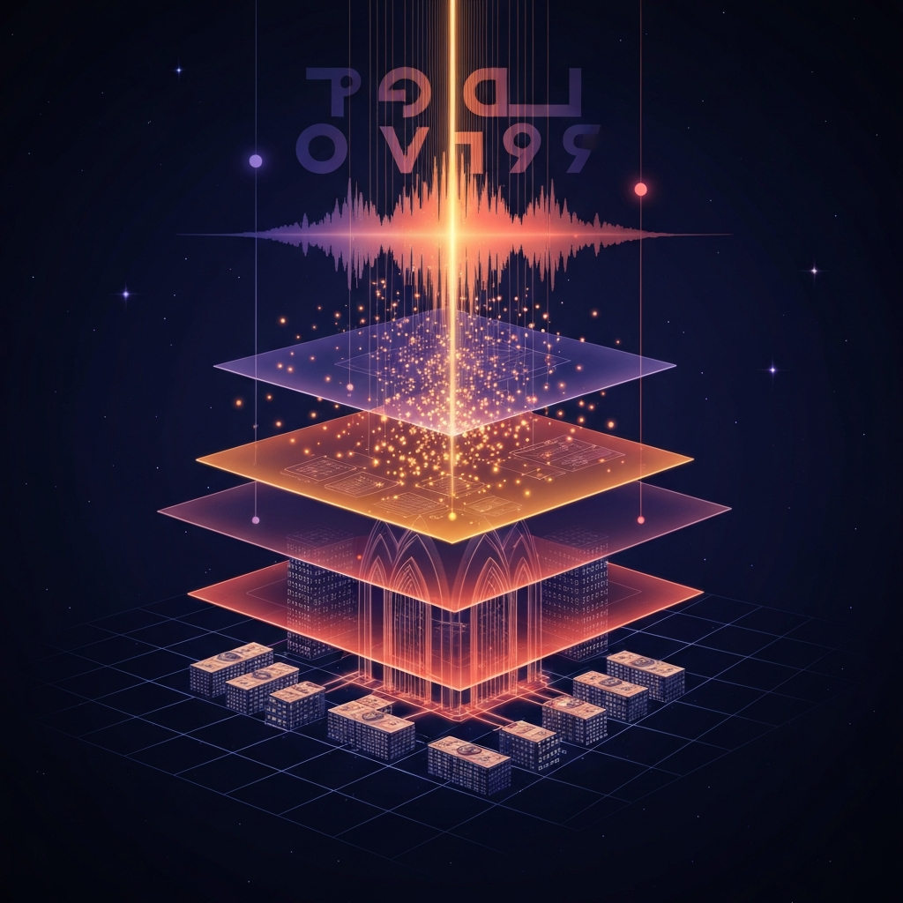

> [!abstract] Zusammenfassung
> Amazon steckt 33 Milliarden Dollar in Anthropic, Jeff Bezos sammelt 10 Milliarden für sein Physik-KI-Lab „Project Prometheus", OpenAIs Codex liest mittlerweile meinen Bildschirm mit, und 44 Prozent aller Songs, die täglich bei Deezer hochgeladen werden, sind vollständig KI-generiert. Drei Bewegungen — Kapital, Autonomie, kulturelle Oberfläche — verdichten sich gleichzeitig. Ein persönlicher Rückblick darauf, warum mich das diese Woche mehr beschäftigt als sonst.

## Eine Woche, in der sich mehrere Dinge gleichzeitig verschoben haben

Es gibt Wochen in der KI-Welt, in denen sich eine einzige große Meldung durchsetzt — ein neues Modell, ein spektakulärer Deal, ein Skandal — und den Rest überlagert. Die vergangene Woche war anders. Sie war still und laut zugleich. Keine einzelne Meldung war der Knall. Aber wenn ich die Schlagzeilen nebeneinanderlege, sehe ich eine Bewegung, die mich stärker beunruhigt als jede Einzelnachricht.

Drei Dinge passieren gleichzeitig: **Das Kapital konsolidiert sich**, **die Software wird eigenständiger**, und **unsere Sprach- und Medienräume füllen sich mit maschinellen Nebenprodukten** — bis zu einem Punkt, an dem ich selbst nicht mehr sicher sagen kann, wo der Mensch endet und die Maschine beginnt.

Ich möchte in diesem Beitrag nicht die Meldungen einzeln durchgehen, als wäre ich ein Newsticker. Ich möchte fragen, was sie in Summe mit uns machen. Und ich möchte ehrlich sein: Ich merke, wie ich selbst in dieser Woche an Stellen stehe, an denen ich noch vor einem Jahr gezögert hätte.

## Das Geld zieht sich zusammen

Die prägendste Zahl der Woche ist eine Finanzmeldung: **Amazon investiert 33 Milliarden Dollar in Anthropic.** Anthropic sagt im Gegenzug zu, über zehn Jahre 100 Milliarden Dollar bei AWS auszugeben. Das ist, wenn man es nüchtern liest, ein zirkuläres Geschäft — der Hyperscaler finanziert das Modell, das dann die Rechenleistung des Hyperscalers bucht. Wer ein Frontier-Modell trainieren will, braucht einen Hyperscaler. Wer als Hyperscaler relevant bleiben will, braucht ein Frontier-Labor. Amazon hat sich jetzt beides in eine Bilanz geholt.

Parallel schließt Jeff Bezos' **„Project Prometheus"** eine Finanzierungsrunde über zehn Milliarden Dollar ab. Das ist kein weiteres Chatbot-Startup. Der Fokus liegt auf physik-orientierter KI für Industrie und Fertigung — kombiniert mit einer Holding-Struktur, die gezielt bestehende Unternehmen übernehmen soll. Das ist ein Kapitalvehikel, kein Forschungsprojekt im klassischen Sinne.

Und während OpenAI Teile seines „Stargate"-Projekts in Europa pausiert, **baut Anthropic erstmals Rechenzentrum-Teams außerhalb der USA auf**: in London und in Sydney. Sie lösen sich sichtbar aus der reinen Cloud-Abhängigkeit und beginnen, eigene Infrastrukturkompetenz aufzubauen.

> [!info] Fünf Firmen, 71 Prozent
> Das Superintelligence-Briefing dieser Woche nennt eine Zahl, die ich mir aufschreibe: **Fünf Konzerne kontrollieren 71 Prozent der globalen KI-Infrastruktur.** Der Engpass liegt dabei längst nicht mehr beim Chip, sondern beim Strom. Elektrizität wird zum strategischen Rohstoff. Wer kein Netz hat, trainiert kein Modell.

Was beschäftigt mich daran? Nicht, dass Geld fließt — das hat es immer getan. Sondern **wie selten wir uns die Gegenfrage stellen**: Wer trifft eigentlich die Entscheidungen, die dieses Kapital formen? Für Europa ist die Antwort dieser Woche unbequem: Ohne eigene Compute- und Energiepolitik sind wir nicht nur preissensibel, wir sind strukturell draußen. Nicht als Nutzer, aber als Mitgestalter.

## Die Agenten lernen zu schauen

Wenn Geld die erste Linie dieser Woche war, dann ist **Autonomie die zweite**. Und diese berührt mich als Entwickler und Nutzer direkter.

OpenAIs Codex bekommt ein Feature namens **„Chronicle"**, das den Bildschirm des Entwicklers mitzeichnet, um daraus Kontext abzuleiten. Der Agent merkt sich, was gerade geöffnet war, welcher Fehler gerade im Terminal stand, welche Pfade ich besucht habe — und knüpft dort an, wenn ich ihn wieder aktiviere. Das ist ein Sprung gegenüber klassischen Chat-Interfaces. Es ist aber auch ein Sprung in einer anderen Richtung: **Was der Agent weiß, weiß er über meine Schulter.**

Ich habe kurz probiert, was sich da tun würde, wenn ich es aktivieren würde. Und ich habe mich ertappt, wie ich zuerst an den Nutzen dachte — bessere Kontexte, weniger erklären müssen — und erst als zweites an die Angriffsfläche. Prompt Injection über Bildschirminhalte ist jetzt ein realistisches Bedrohungsmodell. Und die unverschlüsselte Ablage solcher Kontexte ist keine Randfrage mehr.

Auf der Modellseite meldet sich **Kimi K2.6** zurück — ein Open-Weight-Modell, das GPT-5.4 und Claude Opus 4.6 über **Agent-Swarms** herausfordert: mehrere spezialisierte Agenten, die koordiniert an einer Aufgabe arbeiten. Und als wäre das nicht Signal genug, **leitet Sergey Brin bei Google persönlich eine Initiative**, die das Coding-Gap zu Anthropic schließen soll. Kern des Programms ist der Aufbau selbstverbessernder Modelle — Systeme, die aus ihrer eigenen Code-Historie lernen.

> [!warning] Vibe Coding und die Lücke im Review
> Das Superintelligence-Briefing beschreibt, was gerade parallel passiert: „Vibe Coding" beschleunigt die Entwicklung um das Drei- bis Vierfache — und produziert Sicherheitslücken in einem Tempo, das Review-Teams nicht mehr aufholen. Die Hälfte aller US-Beschäftigten nutzt KI im Job. Aber Gallup und NBER messen eine „massive Lücke" zwischen individueller Produktivität und organisatorischer Wertschöpfung. Die Tools sind da. Die Governance ist es nicht.

Was mich hier beschäftigt, ist nicht die einzelne Meldung, sondern das Muster. **Die Agenten werden nicht nur besser, sie werden auch eigenständiger.** Sie schauen mit. Sie orchestrieren sich selbst. Sie schreiben an sich selbst. Und ich merke: Ich bin noch nicht sicher, welche Arbeit ich ihnen bewusst abgebe und welche sie mir schleichend abnehmen.

## Wenn die Sprache kippt

Die dritte Linie dieser Woche ist die leiseste — und vielleicht die, die mich am meisten zum Nachdenken bringt. Während oben das Kapital verdichtet und in der Mitte die Software autonom wird, verschwimmt unten, auf der Ebene des Outputs, die Grenze zwischen menschlicher und maschineller Produktion.

**Bei Deezer sind 44 Prozent aller Songs, die täglich hochgeladen werden, vollständig KI-generiert.** Der Streamingdienst entwickelt eine Detektionstechnologie, die er anderen Plattformen lizenzieren will. Aus einer Musikplattform wird eine Zertifizierungsstelle für „Echtheit". Das ist kein Nebeneffekt, das ist ein Geschäftsmodell.

Auf der Textseite dasselbe Muster in milder: Die Phrase **„It's not just a ___, it's a ___"** — ein klassisches ChatGPT-Idiom — hat sich in US-Unternehmenskommunikation zwischen 2024 und 2025 **zweimal verdoppelt**. 75 Prozent der PR-Profis nutzen heute KI beim Schreiben und Redigieren. Einzeln ist das harmlos. In Summe heißt es: Die rhetorischen Muster eines einzelnen Modells beginnen, die Oberfläche einer ganzen Berufsgruppe zu prägen.

> [!question] Wer schreibt eigentlich noch, was ich lese?
> Wenn 75 Prozent der PR-Profis KI einsetzen und 44 Prozent aller neuen Musik-Uploads generiert sind — wie viel von dem, was heute an mir vorbeizieht, kommt noch aus einem Kopf? Und, ehrlicher: Wie viel von dem, was ich selbst schreibe, würde ich noch so formulieren, wenn ich den Vorschlag der KI nicht im Augenwinkel hätte?

Dazu passt, was das Wissensmanagement-Magazin diese Woche unter Berufung auf eine PwC-Studie ausgeführt hat: Generative KI liefert messbare Produktivitätsgewinne — 27 Prozent in betroffenen Branchen zwischen 2018 und 2024. Aber sie bringt eine **„schleichende Erosion individueller und organisationaler Lern- und Urteilskompetenz"** mit sich. Wenn Entwurf, Gegenlese und Formulierung dauerhaft ausgelagert werden, verliert ein Team die Fähigkeit, zwischen *gut* und nur *flüssig* zu unterscheiden. Das ist kein lauter Schaden. Das ist ein leiser.

Und genau deshalb ist er schwerer zu adressieren. Arbeitsplatzverlust merkt man. Kompetenzverlust merkt man erst, wenn er da ist.

## Was ich daraus für mich mitnehme

Ich will diese Woche nicht mit einer Analyse enden lassen, sondern mit etwas Praktischem. Das sind die drei Dinge, die ich mir für die kommenden Wochen vornehme — für meine eigene Arbeit, nicht als Handlungsempfehlung an andere.

> [!tip] Drei Vorsätze nach dieser Woche
> **Erst selbst schreiben, dann die KI dazuholen.** Wenn ich einen Text entwerfe, schreibe ich den ersten Entwurf ohne Assistent — selbst wenn er schlechter ist. Erst dann lasse ich mir gegenlesen. Der erste Durchgang ist mein eigener Kopf. Den will ich nicht verlieren.
>
> **Agenten nur mit klarer Kontextgrenze.** Wenn ich einen Codex- oder Claude-Agent mit Screen-Zugriff laufen lasse, wissentlich und befristet. Nicht als Dauermodus. Ich will wissen, was er sieht, und ich will wissen, wann ich ihn ausschalte.
>
> **Die Sprache prüfen, auch die eigene.** Wenn mir ein Satz zu glatt vorkommt — dieses typische „It's not just a ___, it's a ___" –, dann schreibe ich ihn um. Nicht weil KI-Klang per se schlecht wäre, sondern weil ich meine eigene Stimme nicht unmerklich an eine Modellstimme verlieren will.

Diese Dinge sind nicht spektakulär. Sie sind bewusst klein. Ich glaube, dass **die Art und Weise, wie wir jetzt mit KI umgehen, in kleinen Gewohnheiten entschieden wird, nicht in großen Programmen**. Die Unternehmen spielen mit Milliarden. Ich spiele mit der Frage, wann ich „Tab" drücke und wann nicht.

## Schlusswort

Was diese Woche zusammenhält, ist weniger eine einzelne News als eine Geste: **Alle drei Ebenen — Kapital, Autonomie, Ausdruck — verdichten sich gleichzeitig.** Amazon und Bezos sichern die Infrastruktur. OpenAI, Google, Anthropic und ein chinesisches Open-Weight-Lager treiben Agenten in Richtung echter Autonomie. Und die Räume, in denen wir arbeiten und kommunizieren, füllen sich mit den Nebenprodukten dieser Systeme, lange bevor wir sie regulieren oder auch nur bemerken.

Die Woche sagt nicht, dass KI „unkontrollierbar" wird. Sie sagt etwas Subtileres: **Kontrolle wird jetzt überall gleichzeitig entschieden** — im Stromnetz, im Agent-Kontext und im Satzbau. Wer mitentscheiden will, muss an allen drei Orten präsent sein.

Und vielleicht ist das, in einer leisen Form, die wichtigste Einsicht dieser Woche für mich: Ich kann mich bei den Milliarden nicht einmischen. Ich kann aber entscheiden, welchen Platz ich den Agenten in meinem Arbeitstag gebe — und welchen Satz ich selbst schreibe.

---

## 🔗 Verwandte Beiträge

- [[2026-04-20-mythos-tokenizer-und-das-monopol-der-rechenleistung]]
- [[2026-04-13-weltmodelle-fragile-agenten-und-die-seele-der-maschine]]
- [[2026-03-21-ki-agenten-europas-paradox-und-das-ende-der-kontrolle]]
