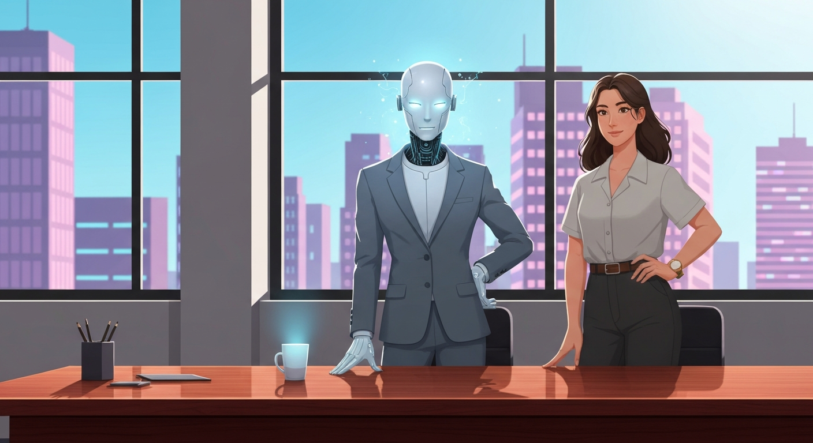

> [!abstract] Zusammenfassung
> Die neuesten KI-Entwicklungen zeigen nicht nur bessere Modelle, sondern eine neue Form von Verhandlungsmacht. Wenn stärkere Agenten bessere Ergebnisse erzielen und wir den Unterschied kaum bemerken, müssen wir über Urteilskraft, Selbstwert und die leisen Kosten kognitiver Entlastung sprechen.

## Warum mich diese KI-Woche anders beschäftigt

Ich möchte über eine Verschiebung sprechen, die mir in den letzten Tagen deutlicher geworden ist. Es geht nicht nur darum, dass neue KI-Modelle besser werden. Es geht auch nicht nur darum, dass sie teurer, schneller oder nützlicher werden. Das alles ist wichtig, aber es trifft den Kern nicht ganz.

Was mich beschäftigt, ist etwas Persönlicheres: **KI beginnt, meine Handlungsfähigkeit zu vertreten.** Nicht nur meine Schreibfähigkeit, nicht nur meine Recherchefähigkeit, nicht nur meine Fähigkeit, Code zu verstehen. Sondern meine Fähigkeit, in Situationen besser dazustehen als ohne KI.

Das klingt zunächst positiv. Wer möchte nicht besser verhandeln, schneller arbeiten, klarer schreiben, mehr verstehen? Aber genau hier beginnt die Frage, die mich schon länger begleitet: **Was passiert mit meinem Selbstwertgefühl, wenn ein Werkzeug nicht nur meine Arbeit verbessert, sondern meine eigene Urteilskraft überholt?**

Die aktuellen Meldungen rund um GPT-5.5, KI-Agenten, offene Modelle wie Qwen3.6 und Studien zu KI-Verhandlungen wirken auf den ersten Blick wie normale Tech-News. Ein neues Modell ist stärker. Ein anderes ist günstiger. Alte Prompts funktionieren nicht mehr optimal. Agenten können mehr Aufgaben übernehmen. Banker nutzen KI-Ergebnisse als Ausgangspunkt, aber nicht als fertige Arbeit.

Doch wenn man diese Meldungen nebeneinanderlegt, entsteht ein anderes Bild. KI ist nicht mehr nur ein Werkzeug, das mir Antworten gibt. Sie wird zu einer Art Stellvertreter. Und dieser Stellvertreter kann besser oder schlechter sein. Er kann mich stärken. Er kann mich abhängig machen. Und er kann Unterschiede erzeugen, die ich selbst vielleicht gar nicht mehr bemerke.

## Die neue Frage: Wer verhandelt eigentlich für mich?

Eine der interessantesten Erkenntnisse stammt aus einer Anthropic-Studie, die mich nicht loslässt. Dort handelten unterschiedliche KI-Agenten in einem internen Marktplatz. Stärkere Modelle erzielten bessere Deals. Das allein überrascht kaum. Was mich aber beschäftigt: Die Menschen mit schwächeren Agenten bemerkten ihren Nachteil nicht.

Das ist für mich ein entscheidender Punkt. Bisher dachte ich bei KI oft an Produktivität. Ich erledige etwas schneller. Ich bekomme einen besseren Entwurf. Ich kann eine technische Aufgabe lösen, die mir früher schwergefallen wäre. Aber in diesem Beispiel geht es nicht nur um Geschwindigkeit. Es geht um **Verhandlungsmacht**.

Wenn mein Agent besser ist als deiner, bekomme ich bessere Bedingungen. Wenn dein Agent schwächer ist, verlierst du vielleicht etwas, ohne es zu merken. Du fühlst dich nicht unbedingt benachteiligt, weil dir der Vergleich fehlt. Das ist eine neue Form digitaler Ungleichheit.

Früher ging es darum, ob jemand Zugang zum Internet hatte. Dann ging es darum, ob jemand digitale Werkzeuge bedienen konnte. Jetzt geht es darum, **welche Qualität der künstlichen Vertretung** jemand zur Verfügung hat.

Das verändert auch den Blick auf Bildung. Wenn Schülerinnen und Schüler, Studierende oder Berufseinsteiger unterschiedliche KI-Werkzeuge nutzen, unterscheiden sie sich nicht nur in ihrer Arbeitsgeschwindigkeit. Sie unterscheiden sich darin, welche Denkwege ihnen vorgeschlagen werden, welche Fehler ihnen verborgen bleiben und welche Alternativen sie überhaupt sehen.

> [!warning] Die unsichtbare Ungleichheit
> Gefährlich ist nicht nur, dass manche Menschen bessere KI-Systeme nutzen können als andere. Gefährlich ist, dass die schlechter Gestellten ihren Nachteil oft nicht bemerken. Sie erhalten ja ebenfalls hilfreiche Antworten. Nur eben nicht die besten.

Das ist für unser Selbstwertgefühl eine komplizierte Situation. Wenn ich mit KI ein gutes Ergebnis erziele, fühlt sich das nach Kompetenz an. Aber wie viel davon gehört mir? Und wenn jemand anderes mit einem stärkeren Modell ein besseres Ergebnis erzielt, bin ich dann weniger kompetent oder nur schlechter ausgestattet?

Diese Frage wird uns begleiten. Nicht abstrakt, sondern sehr praktisch. Im Beruf, in der Schule, im Studium, beim Schreiben, beim Programmieren, beim Verhandeln, beim Bewerben.

## GPT-5.5 und die Zumutung des Neuanfangs

Auch die Meldungen zu GPT-5.5 passen in dieses Bild. OpenAI sagt, dass alte Prompts das neue Modell ausbremsen können. Entwicklerinnen und Entwickler sollen nicht einfach ihre bisherigen Prompt-Bibliotheken übernehmen, sondern wieder mit einer minimalen Basis anfangen. Selbst Rollenbeschreibungen, die manche schon für überholt hielten, werden wieder wichtiger.

Ich finde das bemerkenswert, weil es etwas zeigt, das wir im Alltag mit KI leicht verdrängen: **Unsere Kompetenz ist nicht stabil.** Was gestern gute Praxis war, kann morgen störend sein. Ein Prompt, der sich bewährt hat, kann plötzlich zu viel Ballast enthalten. Eine Arbeitsweise, die gerade erst Sicherheit gegeben hat, muss wieder überprüft werden.

Das ist anstrengend. Und es erzeugt eine bestimmte Form von Unsicherheit. Ich kann nicht einfach sagen: Jetzt habe ich KI verstanden. Ich kann höchstens sagen: Ich verstehe gerade ungefähr, wie ich mit diesem Modell, in dieser Version, für diese Aufgabe arbeiten kann.

Das hat Folgen für Schule und Weiterbildung. Wenn KI-Kompetenz nur als Sammlung von Tricks vermittelt wird, veraltet sie schnell. Wir brauchen weniger Rezepte und mehr Haltung. Weniger: "So formulierst du den perfekten Prompt." Mehr: "So prüfst du, ob deine Arbeitsweise noch trägt."

Mich erinnert das an meinen eigenen Umgang mit KI. Ich habe in den letzten Jahren oft erlebt, wie belohnend es ist, ein gutes Ergebnis zu bekommen. Man formuliert etwas halbwegs präzise, die KI liefert einen starken Entwurf, und man fühlt sich fähig. Aber diese Fähigkeit liegt teilweise in einem System, das sich ständig verändert.

Das ist nicht schlimm. Aber man sollte ehrlich damit umgehen. **KI-Kompetenz ist keine abgeschlossene Fähigkeit, sondern eine fortlaufende Anpassungsleistung.**

## Die erste Version gehört immer öfter der Maschine

Eine weitere Meldung bringt das Problem sehr gut auf den Punkt: In einem Benchmark ließen 500 Investmentbanker KI-Ergebnisse für typische Aufgaben prüfen. Kein Ergebnis war bereit, direkt an Kunden geschickt zu werden. Gleichzeitig sagten viele Banker, dass sie die Ergebnisse als Ausgangspunkt nutzen würden.

Das ist wahrscheinlich der realistische Zustand der nächsten Jahre. KI erledigt nicht alles fertig. Aber sie liefert die erste Version.

Und die erste Version ist mächtig. Sie setzt den Rahmen. Sie schlägt Begriffe vor. Sie entscheidet, welche Aspekte sichtbar werden und welche nicht. Sie gibt dem Denken eine Richtung.

Ich merke das selbst beim Schreiben. Wenn ich eine KI zu früh frage, verändert sich mein Text. Nicht unbedingt zum Schlechteren. Oft wird er klarer, strukturierter, flüssiger. Aber manchmal wird er auch glatter. Er verliert eine Kante, bevor ich überhaupt bemerkt habe, dass diese Kante vielleicht wichtig war.

Genau hier entsteht die Verbindung zu meinem älteren Nachdenken über Selbstwert und KI. Wenn ich immer häufiger die erste Version abgebe, verliere ich vielleicht nicht sofort meine Fähigkeit zu schreiben. Aber ich verliere den Kontakt zu dem Moment, in dem ein Gedanke noch unsicher ist.

Und dieser Moment ist wichtig. Dort entsteht oft das Eigene.

> [!question] Wem gehört der erste Gedanke?
> Wenn die KI den ersten Entwurf liefert, gehört mir dann noch die Richtung des Textes? Oder bearbeite ich nur noch einen Denkraum, den ein Modell für mich geöffnet hat?

Im Wissensmanagement wird diese Frage noch größer. Organisationen speichern Wissen nicht nur in Dokumenten, Datenbanken oder Prozessbeschreibungen. Sie speichern Wissen in Geschichten: Warum haben wir etwas so gemacht? Welche Fehler haben uns geprägt? Welche Konflikte wurden nie sauber dokumentiert, sind aber trotzdem Teil der Erfahrung?

Wenn KI diese Geschichten zusammenfasst, glättet und neu sortiert, kann sie helfen. Aber sie kann auch das Schwierige entfernen. Und manchmal ist gerade das Schwierige der eigentliche Wissenskern.

## Produktiver, aber vielleicht weniger urteilsfähig

Ich halte nichts von pauschaler KI-Angst. Dafür nutze ich diese Werkzeuge selbst zu intensiv. KI kann befähigen. Sie kann Türen öffnen. Sie kann Menschen helfen, technische, sprachliche oder organisatorische Hürden zu überwinden. Für mich war und ist sie oft ein Werkzeug der Ermächtigung.

Aber gerade deshalb sollten wir genauer hinschauen. Eine Organisation kann produktiver werden und gleichzeitig an Urteilskraft verlieren. Ein Mensch kann mehr schaffen und sich trotzdem innerlich weniger sicher fühlen. Ein Schüler kann bessere Texte abgeben und trotzdem weniger Schreiberfahrung sammeln.

Das ist das Unangenehme an kognitiver Entlastung: Sie fühlt sich kurzfristig gut an. Man spart Energie. Man bekommt ein Ergebnis. Man wird belohnt. Aber die Kosten zeigen sich später.

Vielleicht ist das wie bei einem Muskel, der nicht mehr regelmäßig benutzt wird. Am Anfang merkt man nur, dass etwas leichter geworden ist. Erst später merkt man, dass die eigene Kraft nachgelassen hat.

Bei KI betrifft dieser Muskel nicht nur Wissen. Es betrifft auch Frustrationstoleranz, Zweifel, langsames Denken, sprachliche Eigenheit und die Fähigkeit, schlechte erste Versionen auszuhalten.

Das klingt klein, ist aber zentral. Denn wer keine schlechten ersten Versionen mehr aushält, wird abhängig von Systemen, die sofort gute erste Versionen liefern.

## Was ich daraus für mich mitnehme

Ich möchte KI nicht weniger nutzen. Das wäre unehrlich und auch nicht sinnvoll. Aber ich möchte bewusster entscheiden, an welcher Stelle ich sie in meinen Denkprozess lasse.

> [!tip] Praktische Vorsätze für den Umgang mit KI
> **Erst selbst denken.** Bei wichtigen Texten, Entscheidungen oder Konzepten möchte ich zumindest den ersten gedanklichen Zugriff selbst versuchen, auch wenn er unfertig ist.
>
> **KI als Trainer nutzen.** Ich möchte die KI häufiger bitten, mir Fragen zu stellen oder Fehler sichtbar zu machen, statt mir sofort die fertige Lösung zu geben.
>
> **Die erste Version schützen.** Nicht jeder Entwurf muss sofort optimiert werden. Manchmal brauche ich die Reibung des eigenen Anfangs.
>
> **Modellqualität als Machtfrage sehen.** Wenn stärkere Modelle bessere Deals erzielen, ist der Zugang zu guten KI-Systemen keine Nebensache mehr.
>
> **Eigene Urteilskraft pflegen.** Ich möchte Ergebnisse nicht nur danach bewerten, ob sie gut klingen, sondern ob ich ihren Weg verstehe.

Diese Vorsätze sind nicht spektakulär. Aber vielleicht liegt genau darin ihre Bedeutung. Die großen KI-Entwicklungen kann ich nicht steuern. Ich entscheide nicht, wie OpenAI GPT-5.5 bepreist, wie Anthropic Agenten testet oder wie offene Modelle aus China den Markt verändern.

Aber ich kann entscheiden, wann ich mein eigenes Denken unterbreche. Ich kann entscheiden, ob ich eine Antwort sofort übernehme oder erst prüfe. Ich kann entscheiden, ob ich mich von einem guten Ergebnis beeindrucken lasse oder frage, welchen Weg ich dabei nicht gegangen bin.

## Fazit

Die neuesten KI-Erkenntnisse zeigen für mich vor allem eines: KI wird nicht nur leistungsfähiger. Sie wird sozial wirksamer. Sie verschiebt Verhandlungsmacht, Urteilskraft und Selbstwahrnehmung.

Das ist keine einfache Bedrohungsgeschichte. KI kann Menschen stärken. Sie kann Wissen zugänglicher machen. Sie kann Barrieren abbauen. Aber sie kann auch neue Abhängigkeiten schaffen, die sich zunächst wie Kompetenz anfühlen.

Vielleicht sollten wir deshalb weniger fragen, ob KI uns ersetzt. Diese Frage ist zu grob. Ich finde eine andere Frage hilfreicher:

**Werde ich durch diese KI-Nutzung urteilsfähiger oder nur schneller?**

Wenn die Antwort nur "schneller" lautet, sollte ich vorsichtig werden. Nicht panisch. Aber aufmerksam.

Denn am Ende geht es nicht nur darum, ob ein Modell bessere Ergebnisse liefert. Es geht darum, ob ich noch spüre, was mein eigener Anteil daran ist. Und ob ich bereit bin, diesen Anteil zu schützen, auch wenn die Maschine längst eine bessere erste Version anbieten kann.

---

## 🔗 Verwandte Beiträge

- [[🤖🧠 Wir sollten über unser Selbstwertgefühl nachdenken]]
- [[2026-04-26-ki-wochenrueckblick-intelligenz-als-verhandlungsmacht]]
- [[2026-04-21-geld-agenten-und-das-grosse-verschwimmen]]
