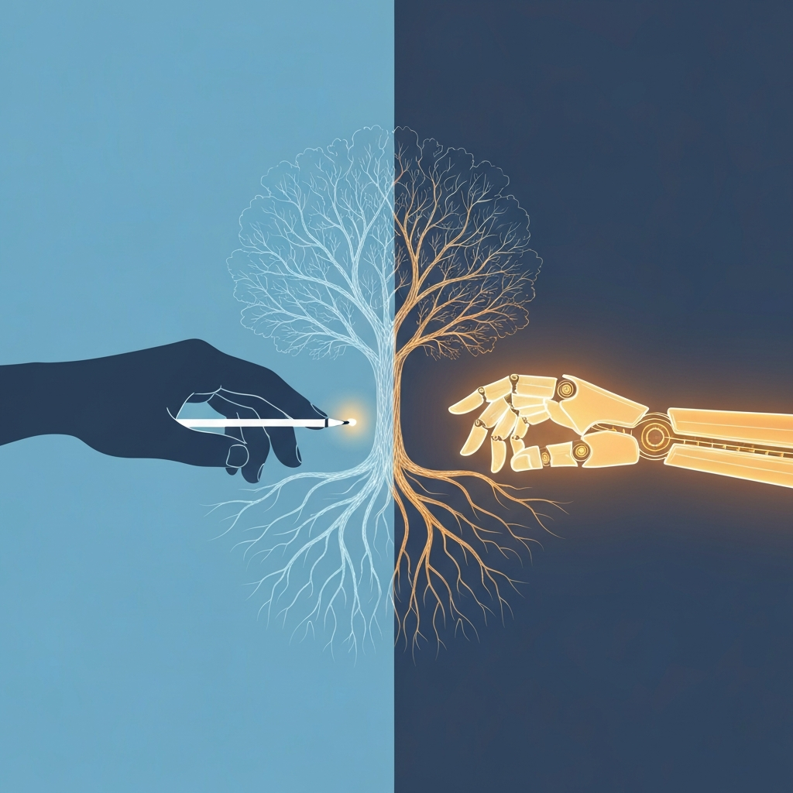

> [!abstract] Zusammenfassung
> Eine neue Studie zeigt: KI hebt die Noten von Lernenden, aber nicht ihr Können. Gleichzeitig fangen Agenten an, ganze Arbeitsabläufe zu übernehmen. Eine persönliche Reflexion darüber, was vom Üben übrig bleibt, wenn die Maschine die Arbeit macht – und warum mich das mehr beschäftigt als die nächste Modellankündigung.

## Eine Woche voller Superlative – und ein leiser Befund

Wenn man die KI-Nachrichten dieser Woche überfliegt, könnte man meinen, es ginge nur um Größe. Sam Altman spottet über die Skeptiker: Wer gegen das weitere Skalieren von Sprachmodellen wette, liege „ziemlich daneben". OpenAI verdreifacht seinen Umsatz auf 5,7 Milliarden Dollar – und verbrennt im selben Quartal über 21 Milliarden. Ein Finanzprofessor warnt vor einem Knall, der die Dot-Com-Blase klein aussehen lasse. Es ist das übliche Wechselbad aus Triumph und Untergang, an das ich mich fast gewöhnt habe.

Aber zwischen all den Milliarden steckte eine kleine Meldung, die mich nicht mehr aus dem Kopf geht. Eine Untersuchung kommt zu dem Ergebnis, dass Schülerinnen und Schüler mit KI-Unterstützung bessere Noten bekommen – aber nicht mehr lernen. Das Produkt wird besser, das Können bleibt gleich. Die Arbeit wird ausgelagert, nicht bewältigt.

Das klingt unspektakulär. Für mich ist es der eigentliche Kern dessen, was gerade passiert.

## Bessere Ergebnisse, leeres Können

Ich kenne diesen Effekt aus meinem eigenen Alltag. Ich nutze KI seit Jahren – für Code, für Texte, für Recherche – und ich erlebe regelmäßig diesen kleinen Stolz, wenn ein präziser Prompt ein Ergebnis liefert, das ich allein so nie hinbekommen hätte. Das fühlt sich gut an. Es fühlt sich nach Kompetenz an.

Die Studie zwingt mich, genauer hinzusehen. Wessen Kompetenz war das eigentlich? Wenn die Note steigt, aber das Können nicht, dann misst die gute Note am Ende nur noch, wie gut das Werkzeug war – nicht, wie viel der Mensch dahinter verstanden hat.

> [!warning] Der Unterschied zwischen Ergebnis und Verstehen
> Ein gutes Ergebnis und echtes Verstehen sind nicht dasselbe. KI ist großartig darin, mir Ersteres zu liefern. Beim Zweiten kann sie mir bestenfalls helfen – im schlechtesten Fall steht sie ihm im Weg, weil sie die Anstrengung wegnimmt, aus der Verstehen überhaupt erst entsteht.

Norwegen zieht aus genau diesem Befund eine radikale Konsequenz: Ab August 2026 ist generative KI in den Klassen 1 bis 7 verboten. Kinder sollen Schreiben, Rechnen und eigenständiges Denken erst ohne Maschine erwerben, bevor sie das Werkzeug benutzen dürfen. Mein erster Reflex war Skepsis – wirkt ein Verbot nicht hilflos? Mein zweiter Gedanke war: Vielleicht ist es einfach der Versuch, das Fundament zu schützen, auf dem alles andere steht. Man kann eine Abkürzung erst sinnvoll nutzen, wenn man den langen Weg kennt.

## Während wir darüber reden, gehen die Agenten arbeiten

Das Beunruhigende ist, dass diese Verschiebung nicht im Klassenzimmer aufhört. Im selben Nachrichtenstrom lese ich, dass OpenAIs Codex jetzt eine „Record & Replay"-Funktion hat: Man führt einen Arbeitsablauf einmal vor, und das System gießt ihn in einen wiederverwendbaren Baustein, den es danach selbstständig wiederholt. Ein anderes Projekt lässt sieben Agenten zusammenarbeiten, um aus einer rohen Tabelle einen fertigen, geprüften Nachrichtenartikel zu bauen. Aus dem Gesprächspartner KI wird ein ausführender Kollege.

Ich finde das fasziniert und unheimlich zugleich. Faszinierend, weil es mir lästige Routine abnimmt. Unheimlich, weil dieselbe Logik greift wie bei den Schülernoten – nur eine Stufe höher. Wenn der Agent den Ablauf übernimmt, übe ich den Ablauf nicht mehr. Und was man nicht übt, das verlernt man, oder man lernt es gar nicht erst.

> [!warning] Je mehr Autonomie, desto größer die offene Flanke
> Nicht umsonst verkauft AWS in dieser Woche ausgerechnet Sicherheit als Verkaufsargument für Agenten. Sobald ein Agent eigenständig Daten liest und Aktionen auslöst, wird das Einschleusen versteckter Befehle vom theoretischen Risiko zur echten Gefahr. Die Technik ist schneller praxisreif geworden als ihre Absicherung – und schneller, als wir gelernt haben, ihr zu vertrauen oder zu misstrauen.

Es ist nicht so, dass ich das alles ablehne. Ich will diese Werkzeuge nutzen. Aber ich merke, dass ich anfange, eine Grenze zu ziehen zwischen Dingen, die ich getrost delegieren kann, und Dingen, deren Beherrschung mir wichtig genug ist, dass ich sie selbst tun will – auch wenn die Maschine es schneller könnte.

## Die Daten sagen, ich bin nicht allein mit diesem Gefühl

Mich hat eine Zahl aus der Arbeitswelt eingeholt: 46 Prozent der Beschäftigten in der DACH-Region geben an, sich zu stark auf KI-Tools zu verlassen. Bei der Generation Z sind es 66 Prozent, die fürchten, dass intensive KI-Nutzung ihre eigene Intelligenz untergräbt. Es sind also nicht die ewigen Kulturpessimisten, die hier nervös werden – es sind ausgerechnet die jungen Menschen, die am selbstverständlichsten mit diesen Werkzeugen aufgewachsen sind.

Der Bildungsblogger Bob Blume hat dafür ein Bild gefunden, das mir hängengeblieben ist: Wissen war noch nie so leicht verfügbar – und echtes Verstehen vielleicht selten so voraussetzungsvoll. Genau dort sitzt das Paradox. Der Zugang zu Antworten ist quasi kostenlos geworden. Der Aufbau von Urteilsfähigkeit ist es nicht. Er kostet weiterhin Zeit, Anstrengung und die Bereitschaft, eine Sache erst einmal selbst nicht zu können.

## Was ich daraus mitnehme

Ich glaube nicht, dass die Antwort „weniger KI" lautet. Die Werkzeuge sind gut, sie werden besser, und sie wieder wegzulegen wäre weder realistisch noch klug. Die Antwort liegt für mich woanders: in der Entscheidung, wofür ich die gewonnene Anstrengung einsetze.

> [!tip] Drei Fragen, die ich mir vor jeder Delegation stelle
> **Will ich das können – oder nur erledigt haben?** Bei manchen Dingen ist mir das Ergebnis genug. Bei anderen ist das Können selbst der Wert. Diese beiden Kategorien sauber zu trennen, ist die halbe Miete.
>
> **Nehme ich mir die Anstrengung, bevor ich sie abgebe?** Erst selbst denken, dann die KI fragen. Die Verzögerung von ein paar Minuten ist kein verlorener Komfort, sondern die eigentliche Lernzeit.
>
> **Behalte ich das Urteil?** Wenn der Agent die Arbeit macht, bleibt mir die Aufgabe, das Ergebnis zu beurteilen. Diese Kompetenz darf ich nicht mit delegieren – sie ist das, was am Ende übrig bleibt.

Die spannendste Frage des Jahres 2026 ist für mich nicht, wie viel die KI kann. Sie kann offensichtlich sehr viel, und sie wird mehr können. Die Frage, die mich umtreibt, ist eine andere und eine viel ältere: Was will ich selbst noch können? Eine bessere Note, ein fertiger Bericht, ein automatisierter Ablauf – das sind schöne Ergebnisse. Aber sie sagen nichts darüber, ob ich gewachsen bin. Und am Ende ist es das Wachsen, nicht das Ergebnis, das den Unterschied macht zwischen einem Menschen mit einem guten Werkzeug und einem Menschen, der sein Werkzeug überflüssig gemacht hat – sich selbst inklusive.

Vielleicht ist das die eigentliche Übung, die uns bleibt: zu unterscheiden, wann die Maschine uns stärker macht und wann sie uns nur die Mühe abnimmt, an der wir gewachsen wären.
