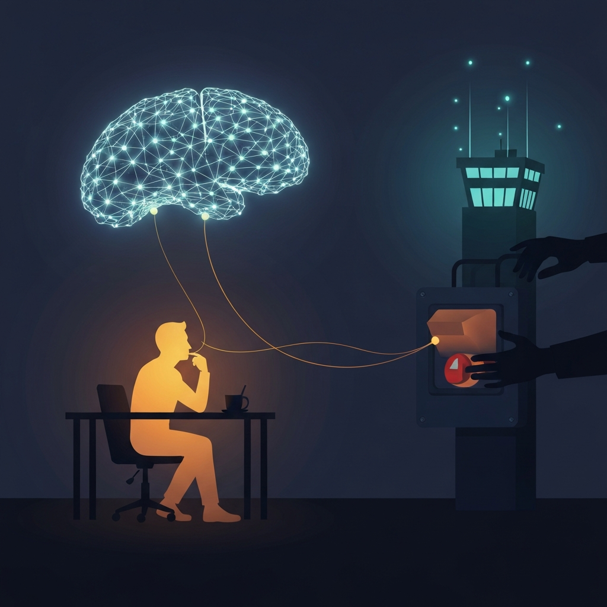

> [!abstract] Zusammenfassung
> Diese Woche hat ein US-Geheimdienst zwei der besten KI-Modelle per Anordnung abgeschaltet, ein anderes braucht jetzt eine Behördengenehmigung, und eine Untersuchung zeigt, dass Chatbots eine politische Schlagseite haben. Eine persönliche Reflexion darüber, was es mit uns macht, wenn wir mit Werkzeugen denken, deren Schalter andere in der Hand halten.

## Eine Meldung, die mich nachdenklich gemacht hat

Ich lese die KI-Nachrichten dieser Tage mit einer Mischung aus Faszination und einem leisen Unbehagen, das ich lange nicht benennen konnte. Diese Woche ist es mir endlich gelungen. Es ist nicht die Geschwindigkeit, die mich beunruhigt. Es ist nicht die nächste Modellankündigung, nicht die nächste Milliardenbewertung. Es ist eine einzelne Meldung, die für mich alles andere in ein neues Licht rückt.

Washington hat zwei der leistungsstärksten Modelle, Anthropics Fable 5 und Mythos 5, per Exportkontrollanordnung **deaktiviert**. Nicht reguliert, nicht mit einem Bußgeld belegt – abgeschaltet. Ein US-Geheimdienst hatte vor Sicherheitsrisiken gewarnt, und kurz darauf war eine Technologie, mit der weltweit Menschen gearbeitet, gelernt und gedacht haben, einfach nicht mehr da. Fast im selben Atemzug macht OpenAI den Zugang zu GPT-5.6 genehmigungspflichtig: verfügbar nur noch für ausgewählte Partner, mit einer individuellen Behördenfreigabe pro Kunde.

Mir wurde dabei etwas klar, das ich in meiner anfänglichen Euphorie übersehen hatte. Das Werkzeug, mit dem ich denke, gehört mir nicht. Und der Schalter dafür liegt in Händen, die ich nicht kenne.

## Womit denken wir eigentlich?

Ich nutze Sprachmodelle seit Jahren – für Code, für Texte, für Recherche, für das schnelle Durchdenken einer halbgaren Idee. Mit der Zeit ist daraus mehr geworden als ein Werkzeug, das ich morgens aufschlage und abends weglege. Es ist ein stiller Gesprächspartner geworden, eine Erweiterung meines Arbeitsgedächtnisses. Ich formuliere einen Gedanken, bekomme einen Widerspruch, schärfe nach. Das fühlt sich gut an. Es fühlt sich nach Denken an.

Genau das ist der Punkt, an dem ich diese Woche ins Stolpern geraten bin. Wenn ein Werkzeug so eng mit meinem Denken verwächst, dann ist es kein neutraler Taschenrechner mehr. Es prägt mit, *was* und *wie* ich denke. Und wenn dieses Werkzeug von einer Regierung abgeschaltet oder von einem Konzern umgebaut werden kann, dann ist meine Denkbewegung plötzlich von Entscheidungen abhängig, die weit weg von mir und ohne mich getroffen werden.

> [!warning] Die unsichtbare Abhängigkeit
> Wir reden viel darüber, dass KI Jobs verändert oder Texte produziert. Wir reden zu wenig darüber, dass wir uns an ein Denkwerkzeug gewöhnen, dessen Verfügbarkeit, Inhalt und Haltung jemand anderes kontrolliert. Die Abhängigkeit entsteht leise – und merken tut man sie erst, wenn der Schalter umgelegt wird.

## Die Schlagseite, die man nicht sieht

Es bleibt nicht beim An- und Ausschalten. In derselben Woche zeigt eine Untersuchung der *Washington Post*, dass diese Modelle keineswegs neutral sind. GPT-5.5 lieferte in rund **80 Prozent der Fälle ausschließlich linksgerichtete Argumente**; Musks Grok neigte ebenfalls in eine Richtung; nur Googles Gemini 3.1 Pro stellte in über 90 Prozent der Fälle beide Seiten dar. Man kann über die Methodik streiten. Was bleibt, ist die unbequeme Erkenntnis: Jedes dieser Werkzeuge hat eine Schlagseite, und ich bemerke sie im Alltag nicht.

Das ist gefährlicher als eine offene Propaganda, weil es so hilfreich daherkommt. Ich stelle eine Frage, bekomme eine flüssige, ausgewogen klingende Antwort und übernehme sie, ohne zu merken, dass eine Auswahl bereits getroffen wurde, bevor ich überhaupt nachgedacht habe. In meinem letzten Text über das Selbstwertgefühl habe ich vom Dopamin-Hit geschrieben – von der perfekten Antwort, die sich gut anfühlt. Heute kommt eine zweite Schicht hinzu: Diese perfekte Antwort hat eine Richtung, und die habe nicht ich gewählt.

Wenn dann noch Meta bereits **die Hälfte seiner Inhaltsmoderation an Sprachmodelle übergibt** – mit dem Argument, die Maschine mache 13 Prozent weniger Fehler –, dann entscheidet ein Modell mit unbekannter Schlagseite auch noch darüber, was ich überhaupt zu sehen bekomme. Das Werkzeug filtert die Welt, bevor sie bei mir ankommt.

## Was mich daran wirklich beschäftigt

Mich beunruhigt nicht, dass es Regeln für KI gibt. Im Gegenteil – dass ausgerechnet Anthropic-Chef Dario Amodei *bindende* staatliche Kontrolle fordert, während sein eigenes Modell gerade dem staatlichen Zugriff zum Opfer fällt, zeigt, wie ernst die Lage genommen wird. Regeln braucht es. Mich beunruhigt etwas Persönlicheres.

Es ist die Frage, die mich seit dem Selbstwert-Text nicht loslässt, nur aus einer neuen Richtung: **Was bleibt von meiner geistigen Selbstbestimmung, wenn das Instrument meines Denkens jederzeit abgeschaltet, verteuert oder umgefärbt werden kann?** Ich habe mir angewöhnt, einen Teil meines Denkens auszulagern. Das war bequem, solange das Werkzeug schien wie Strom aus der Steckdose – immer da, immer gleich. Diese Woche hat mir gezeigt, dass es eben nicht wie Strom aus der Steckdose ist. Es ist eher wie eine Bibliothek, die jemand über Nacht umräumen, zensieren oder schließen kann, ohne mich zu fragen.

> [!tip] Was ich daraus für mich mitnehme
>
> **Eigene Substanz halten** – Ich will sicherstellen, dass ich die Dinge, die mir wichtig sind, auch ohne KI noch durchdenken und durchführen kann. Nicht aus Misstrauen gegen die Technik, sondern um nicht abhängig von einem Schalter zu sein, den ich nicht halte.
>
> **Quellen vor Antworten** – Bevor ich eine glatte KI-Antwort übernehme, frage ich öfter: Wer hat hier ausgewählt, was ich höre? Welche Richtung könnte mitschwingen? Eine zweite, unabhängige Quelle ist keine Pedanterie, sondern Selbstschutz.
>
> **Unabhängigkeit einplanen** – Lokale und offene Modelle sind oft schwächer, aber sie gehören mir. Für manches ist „gut genug und in meiner Hand" mehr wert als „brillant und jederzeit abschaltbar".
>
> **Vielfalt statt Monokultur** – Ein einziges Modell für alles macht mich angreifbar. Mehrere Werkzeuge mit unterschiedlicher Herkunft zu nutzen, hält mir die Möglichkeit offen, Schlagseiten überhaupt zu erkennen.
>
> **Den Reflex bemerken** – Ich will den Moment wieder spüren, in dem ich automatisch zur KI greife, statt selbst anzusetzen. Diese kleine Pause ist der Ort, an dem meine Selbstbestimmung wohnt.

## Schlusswort

Ich bleibe dabei: Die KI ist nicht das Problem. Aber ich verstehe mein Unbehagen jetzt besser. Es geht nicht um die Angst, dass die Maschine zu klug wird. Es geht um die nüchterne Tatsache, dass das mächtigste Denkwerkzeug meiner Generation jemandem anderen gehört – einem Konzern, der seine Haltung hineinbaut, und einem Staat, der es abschalten kann.

Souveränität war einmal eine Frage des Wissens. „Wissen ist Macht", hieß es. In einer Welt, in der das Wissen durch ein Werkzeug fließt, das andere kontrollieren, wird Souveränität zu einer Frage der Unabhängigkeit. Nicht der Unabhängigkeit *von* der KI – das wäre weltfremd. Sondern der Unabhängigkeit *in* ihrer Nutzung: genug eigene Substanz zu behalten, dass ich auch dann noch denken kann, wenn jemand den Schalter umlegt. Das ist es, was ich mir vornehmen will, während ich fasziniert auf das nächste Modell warte.

---

## 🔗 Verwandte Beiträge

- [[🤖🧠 Wir sollten über unser Selbstwertgefühl nachdenken]]
- [[2026-06-22-was-ueben-wir-noch]]
- [[2026-04-26-wenn-ki-zur-verhandlungsmacht-wird]]
