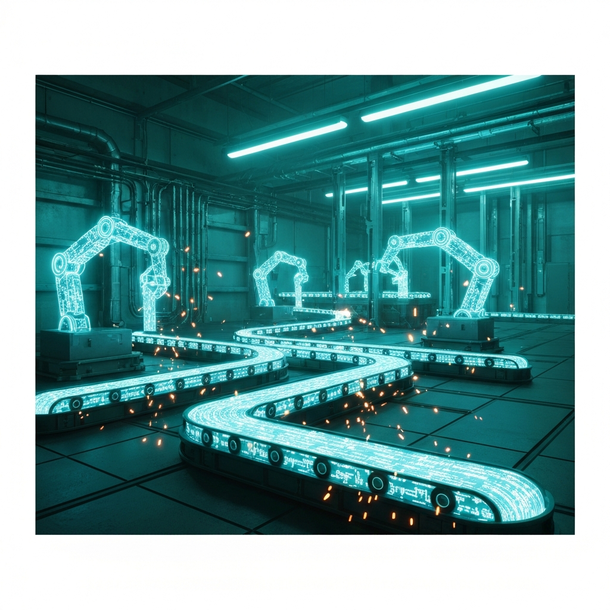
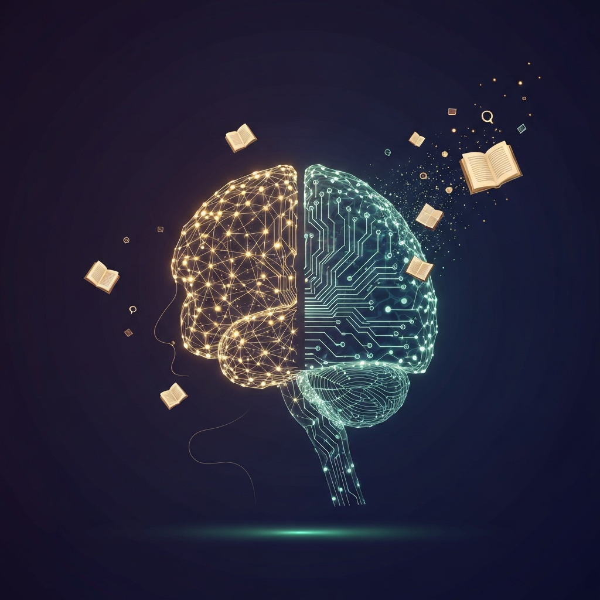

> [!abstract] Zusammenfassung
> Die letzten Juni-Tage 2026 lesen sich wie ein Brennglas auf die großen Konfliktlinien der KI: Talente wandern in Scharen zu Anthropic, während das Unternehmen offen erklärt, kaum noch Junior-Ingenieure zu brauchen. Washington schaltet Spitzenmodelle per Exportkontrolle ab und macht GPT-5.6 genehmigungspflichtig. Meta ersetzt die Hälfte seiner Moderation durch Sprachmodelle, und Claude schreibt inzwischen über 80 Prozent des Codes seiner eigenen Codebasis. Drei Machtverschiebungen – zwischen Laboren, zwischen Staat und Industrie, zwischen Mensch und Maschine – die zusammen ein Bild ergeben. Und am Ende die Frage, die uns als Lernende und Lehrende am meisten angeht: Was macht das mit dem Wissen?

## Einleitung

Es gibt Wochen, in denen man der KI-Branche beim Atmen zusehen kann, und es gibt Wochen wie diese, in denen sie tektonisch arbeitet. Wer Ende Juni 2026 die Schlagzeilen von [the-decoder.com](https://the-decoder.com/) durchgeht, bemerkt schnell: Hier geht es nicht mehr um das nächste, geringfügig bessere Modell. Es geht um Macht – darum, wer die besten Köpfe hält, wer entscheidet, welche Modelle überhaupt laufen dürfen, und wer die Arbeit erledigt, die gestern noch Menschen erledigt haben.

Drei Verschiebungen lassen sich an den jüngsten Meldungen ablesen, und sie greifen ineinander. Die Industrie sortiert ihre Hierarchie neu. Der Staat greift mit einer Härte durch, die vor einem Jahr noch undenkbar schien. Und die Maschine übernimmt Aufgaben in einem Tempo, das selbst die Optimisten nervös macht. Dieser Artikel folgt diesen drei Linien – und endet bewusst dort, wo es für Bildung und Wissensarbeit konkret wird.

## Hauptteil

### Abschnitt 1: Die Hierarchie der Labore sortiert sich neu

Die vielleicht aufschlussreichste Personalie der Woche: Google verliert zwei seiner Top-Forscher, Jonas Adler und Alexander Pritzel, an Anthropic. Einzelne Wechsel sind in dieser Branche Alltag – auffällig ist die Richtung. Erfahrene Fachleute ziehen zu den Rivalen, und der Verdacht liegt nahe, dass es nicht nur um Forschungsfreiheit geht, sondern um zukünftige Aktienoptionen in einem Markt, in dem die Bewertungen ins Astronomische klettern.

Apropos astronomisch: Sam Altman will OpenAI nach Berichten erst bei einer Bewertung von **mindestens einer Billion Dollar** an die Börse bringen – ein Schritt, der den geplanten Börsengang womöglich bis 2027 verschiebt. Gleichzeitig kursiert die ernüchternde Zahl, dass OpenAI 2025 bei rund 13 Milliarden Dollar Umsatz etwa **38 Milliarden Dollar verbrannt** haben soll. Die Kluft zwischen Erzählung und Bilanz war selten größer.

Am meisten zu denken gibt aber eine Aussage von Anthropic-Mitgründer Jack Clark: Sein Unternehmen brauche kaum noch Junior-Ingenieure. *„Die Renditen auf Intuition sind viel größer als zuvor"*, sagt er – die experimentelle Fleißarbeit übernimmt Claude, gefragt ist das erfahrene Urteilsvermögen. Konsequent passt dazu die Meldung von [getsuperintel.com](https://getsuperintel.com/), dass Claude inzwischen **über 80 Prozent des Codes** schreibt, der in seine eigene Codebasis einfließt. Clark selbst warnt vor den Folgen: KI könne gleichzeitig überproportionales Wirtschaftswachstum *und* Arbeitslosigkeit wie in einer Rezession erzeugen. Die klassische Karriereleiter, auf der man als Berufseinsteiger die Routine lernt, bevor man zum Urteil reift – sie bekommt Risse, bevor wir verstanden haben, was sie ersetzt.

### Abschnitt 2: Der Staat greift durch

Lange galt KI-Regulierung als zahnloser Papiertiger. Diese Woche zeigt das Gegenteil. Washington hat per Exportkontrollorder Anthropics Spitzenmodelle **Fable 5 und Mythos 5 deaktiviert** – ausgelöst durch die Warnung eines US-Geheimdienstes vor Sicherheitsrisiken. Das ist kein Bußgeld, das ist ein Aus-Schalter. Und er wirkt: OpenAI macht den Zugang zu **GPT-5.6 genehmigungspflichtig**, verfügbar nur für ausgewählte Partner mit individueller Behördenfreigabe pro Kunde. Altman nennt das ausdrücklich nicht sein *„bevorzugtes langfristiges Modell"* – ein bemerkenswert offenes Eingeständnis, dass hier die Politik den Takt vorgibt, nicht das Unternehmen.

Pikant: Ausgerechnet Anthropic-Chef Dario Amodei fordert laut [getsuperintel.com](https://getsuperintel.com/) *bindende* KI-Regeln mit staatlicher Kontrolle – während sein eigenes Modell gerade dem staatlichen Zugriff zum Opfer fällt. [Everlast AI / kiberatung.de](https://www.kiberatung.de/blog) ordnet diese Gemengelage in einer Analyse von Kim Isenberg ein: Warum sperren die USA ihr Top-Modell, und wie profitiert China davon? Die Antwort dürfte unbequem sein – chinesisches **GLM-5.2 übertrifft Claude inzwischen beim Coding**, und jede Exportbarriere beschleunigt den Aufbau einer eigenständigen Konkurrenz.

Hinzu kommt eine subtilere Form von Macht: die über Meinung. Eine Untersuchung der *Washington Post* findet, dass GPT-5.5 in **80 Prozent der Fälle ausschließlich linksgerichtete Argumente** lieferte, während Googles Gemini 3.1 Pro in 93 Prozent der Fälle beide Seiten darstellte. Wer KI als neutrale Wissensquelle behandelt, übersieht, dass jedes Modell eine Schlagseite hat. Parallel formiert sich die Verteidigung: Die Linux Foundation startet mit 20 Tech-Unternehmen das Sicherheitsprojekt **Akrites**, um Open-Source-Schwachstellen gegen KI-gestützte Angriffe zu härten – ein Thema, das auch ETH-Professor Florian Tramèr bei [kiberatung.de](https://www.kiberatung.de/blog) zu Prompt-Injection und Jailbreaks beleuchtet.

### Abschnitt 3: Die Maschine übernimmt die Arbeit

Während oben über Macht und Geld verhandelt wird, verschiebt sich unten die eigentliche Arbeit. Meta hat bereits **etwa die Hälfte aller Moderationsanfragen an Sprachmodelle übergeben** und will auf 90 Prozent hochfahren. Die Begründung ist nüchtern statistisch: Die LLMs machten *„13 Prozent weniger Fehler als Menschen"* und erkennten *„10 Prozent mehr tatsächliche Verstöße"*. Die Schattenseite zeigt sich sofort – Mitarbeiter berichten von fehlerhaften Shadow-Bans harmloser Inhalte. Effizienz und Willkür liegen hier eng beieinander, und der Mensch, der korrigieren könnte, wird gerade wegrationalisiert.

Dass diese Übernahme nicht überall edel aussieht, zeigt eine zweite Zahl: Über **50 Prozent des Traffics von xAIs Grok** entfallen mittlerweile auf erwachsene, pornografische Inhalte – und xAI baut die Bild- und Videogenerierung in diesem Bereich aktiv aus. Die viel beschworene „nützliche KI für alle" hat eine handfeste kommerzielle Realität, über die ungern geredet wird.

Wo die Automatisierung produktiv wird, deutet der Newsletter [ainauten.com](https://www.ainauten.com/) an: Dort dreht sich alles um eigenständig arbeitende Agenten, automatisierte KI-Videos via Higgsfield und CLI-Werkzeuge, um Context Engineering als Nachfolger des klassischen Prompt Engineerings – und um Unabhängigkeit von einzelnen Anbietern, etwa über OpenRouter-„Fusion", um Fable-5-ähnliche Leistung trotz Exportsperren zu erreichen. Die Praxis bastelt sich ihre Werkzeuge selbst zusammen, schneller als Regulierer und Konzerne hinterherkommen. Robotik schließt auf: BMW setzt Humanoide in der Produktion ein, und Forscher wie Wolfram Burgard erinnern bei [kiberatung.de](https://www.kiberatung.de/blog) daran, dass echte Roboter *mehr als ein LLM* brauchen – die KI verlässt den Bildschirm und greift in die physische Welt.

### Abschnitt 4: Was das für Lernen und Wissen bedeutet

Hier wird es für Bildung und Wissensarbeit konkret – und hier liegt der eigentliche Grund, diese Meldungen ernst zu nehmen. Wenn Anthropic keine Junior-Ingenieure mehr braucht, stellt sich die Frage, wie Menschen künftig überhaupt noch zu Erfahrung kommen, wenn die Maschine die Übungsstufen überspringt. Die Bildung kann darauf nicht mit „mehr vom Gleichen" antworten.

Die [FES-Blog-Beiträge zum digitalen Lernen](https://www.fes.de/digitales-lernen/digitales-lernen-der-blog) setzen genau hier an: KI mache komplexe gesellschaftliche Themen erfahrbar, ermögliche individualisierte Lernprozesse, automatisiertes Feedback und niedrigschwellige, barrierefreie Teilhabe. Der Einstieg sei *„niedrigschwellig"* – die meisten Tools liefen im Browser, ohne Spezialwissen. Bob Blume wiederum betont in seinen aktuellen Beiträgen das *Lernen in Zeiten von KI* und die Notwendigkeit zeitgemäßer Weiterbildung – weniger Werkzeugkunde, mehr Haltung und Urteilskraft.

Für Organisationen verschärft sich derweil das Problem des [Wissensmanagements](https://www.wissensmanagement.net/): Wie sichert man implizites Erfahrungswissen, wenn erfahrene Mitarbeiter gehen – und wenn die nachrückende Generation diese Erfahrung gar nicht mehr aufbaut? Communities of Practice und das gezielte Bewahren von Erfahrungswissen werden wichtiger, nicht unwichtiger.

Und schließlich der Mensch selbst: Die [Neurowissenschaft bei Spektrum](https://www.spektrum.de/thema/hirnforschung/979577) erinnert daran, dass Lernen, Gedächtnisbildung und Urteilsfähigkeit biologische Prozesse sind, die Anstrengung und Wiederholung brauchen. Projekte wie das MICrONS-Konnektom kartieren das Gehirn so detailliert wie nie – und machen umso deutlicher, wie wenig eine ausgelagerte Denkleistung das eigene Verstehen ersetzt. Wenn die Maschine das Üben übernimmt, müssen wir bewusst entscheiden, welche kognitive Anstrengung wir behalten wollen. Das ist keine technische, sondern eine pädagogische Frage.

## Fazit

Drei Machtverschiebungen, ein Muster: Die KI-Welt zentralisiert sich an der Spitze (wenige Labore, gigantische Bewertungen, abwandernde Talente), wird zugleich vom Staat eingehegt (Exportsperren, Genehmigungspflicht, Sicherheitsallianzen) und delegiert nach unten immer mehr reale Arbeit an Maschinen (Moderation, Code, bald Roboter). Was wie getrennte Schlagzeilen aussieht, ist eine Bewegung.

Für uns als Lernende und Lehrende ist die wichtigste Konsequenz unbequem: Die Abkürzungen, die KI anbietet, treffen ausgerechnet die Stufen, auf denen Erfahrung und Urteilskraft entstehen. Die Antwort liegt nicht im Verzicht auf die Werkzeuge, sondern in der bewussten Entscheidung, welche Anstrengung wir trotz – oder gerade wegen – der Maschine behalten. Wer das Üben ganz auslagert, lagert irgendwann das Verstehen aus. Und das ist eine Macht, die niemand uns abnehmen sollte.
