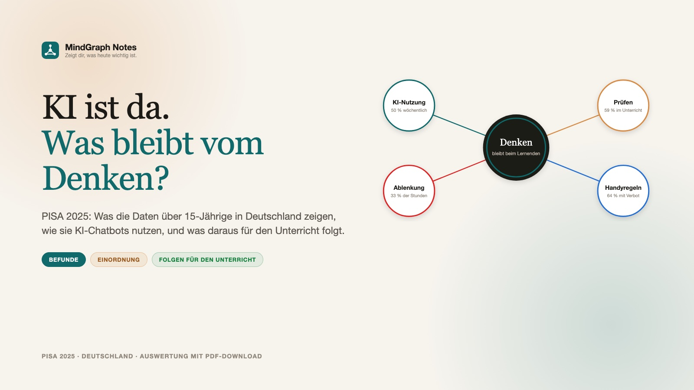

*Titelmotiv der Auswertung. Vier Befunde um ein Zentrum: Wo findet die Denkarbeit statt?*

> [!abstract] Kurzfassung
> Am 8. September 2026 hat die OECD die Ergebnisse von PISA 2025 veröffentlicht, zeitgleich der nationale Berichtsband des ZIB. Deutschland erreicht in Naturwissenschaften, Lesen und Mathematik die niedrigsten Werte seit Beginn der Studie. Zum ersten Mal hat PISA auch erhoben, wie Jugendliche KI-Chatbots für die Schule nutzen. Ich habe die Zahlen für Deutschland aus den Originalberichten zusammengetragen, mit dem OECD-Schnitt und der Schweiz verglichen und daraus drei Folgen für den Unterricht abgeleitet. Das Ergebnis gibt es als Bericht auf dieser Seite und als zwölfseitiges Carousel zum Herunterladen.

> [!tip] Download
> **[Auswertung als PDF herunterladen](https://mindgraph-notes.de/blog/PISA2025-Deutschland-KI-Auswertung.pdf)** (12 Seiten, 1,2 MB) · **[Carousel im Browser ansehen](https://mindgraph-notes.de/blog/PISA2025-Deutschland-KI-Auswertung.html)**
> Alle Zahlen stammen aus OECD Band I, der Ländernotiz Deutschland und dem Nationalen Berichtsband des ZIB. Die Quellenliste steht am Ende des Artikels.

## Warum ich diese Auswertung gemacht habe

Anfang der Woche kursierte ein Carousel aus der Schweiz, das die PISA-Befunde zu KI und Lernen für Schweizer Lehrkräfte aufbereitet. Die Schweizer Zahlen sind interessant, aber für den Unterricht hierzulande braucht es die deutschen. Also habe ich die Ländernotiz Deutschland, den OECD-Hauptband und den nationalen Berichtsband des ZIB gelesen und die Auswertung für Deutschland nachgebaut. Dabei zeigte sich: An zwei Stellen weichen die deutschen Befunde deutlich von den Schweizer ab, und beide Stellen sind für den Unterricht die wichtigsten.

PISA misst Zusammenhänge, keine Ursachen. Alle Punktwerte in diesem Text sind Korrelationen nach Kontrolle sozialer Merkmale. Sie belegen keine Wirkung. Das steht hier einmal ausdrücklich, damit ich es nicht in jedem Absatz wiederholen muss.

## Der Kontext: historische Tiefstände in allen drei Bereichen

Deutschland liegt 2025 in Naturwissenschaften, Lesen und Mathematik im OECD-Durchschnitt. Zugleich sind es die niedrigsten Werte seit Beginn von PISA im Jahr 2000. Vor diesem Hintergrund sind die KI-Befunde zu lesen.

| Kennzahl | Deutschland | Einordnung |
|---|---|---|
| Naturwissenschaften (Schwerpunkt) | 486 Punkte | −7 zu 2022 (nicht signifikant), OECD 482 |
| Lesen | 465 Punkte | −15 zu 2022, signifikant |
| Mathematik | 464 Punkte | −11 zu 2022, signifikant |
| Unter Mindestniveau (Stufe 2) | ca. ⅓ in Lesen und Mathematik, 27 % in Naturwissenschaften | Anstieg seit 2015 um 17, 15 bzw. 10 Prozentpunkte |
| Sozialer Leistungsabstand (oberes vs. unteres Viertel) | 125 Punkte | OECD: 85 Punkte, seit 2015 gewachsen |
| Unterricht durch Lehrkräftemangel beeinträchtigt | 52 % der Schüler:innen | OECD: 39 % |
| „Schule war Zeitverschwendung“ | 33 % Zustimmung | OECD: 24 % |

**KI trifft auf ein System unter Druck.** Der Nationalbericht des ZIB beschreibt drei Entwicklungen: Mehr Jugendliche erreichen die Basiskompetenzen nicht, die Leistungen hängen eng mit der sozialen Herkunft zusammen, und Klassenführung sowie Unterstützung durch Lehrkräfte werden schlechter bewertet als im OECD-Schnitt. Chatbots kommen also in Klassenzimmer, in denen die Grundlagen bereits bröckeln. Umso mehr zählt, ob die Nutzung das eigene Denken fordert oder abnimmt.

## Fünf Befunde

### Befund 1 · KI als Lernhilfe: 50 %

Die Hälfte der 15-Jährigen in Deutschland nutzt KI-Chatbots mindestens wöchentlich, um sich beim Lernen helfen zu lassen.

| Wöchentliche Nutzung „um mir beim Lernen zu helfen“ | Anteil |
|---|---|
| Deutschland | 50 % |
| OECD | 46 % |
| Schweiz | 55 % |

Wofür KI mindestens wöchentlich genutzt wird: Text für Hausaufgaben entwerfen 36 % (OECD 29 %), gelesenen Text zusammenfassen 36 % (OECD 30 %), Vorabrecherche zu einem neuen Thema 31 % (OECD 31 %). Nur 9 % geben an, KI nie oder fast nie für Schularbeiten zu nutzen (OECD 14 %). Beim Index der KI-Nutzung für schulische Aufgaben liegt Deutschland laut Nationalbericht signifikant über dem OECD- und dem EU-Schnitt.

Chatbots gehören für die Hälfte der Jugendlichen zum Lernalltag. Ob Schulen KI zulassen, entscheidet sich damit nicht mehr im Klassenzimmer. Offen ist nur noch, wie der Unterricht damit umgeht.

### Befund 2 · Nutzung und Leistung: −13 Punkte

Wer KI häufiger für Schularbeiten nutzt, schneidet in Deutschland in Naturwissenschaften im Schnitt um rund 13 Punkte schlechter ab.

**Die Analyse des ZIB.** Für Deutschland wurde geprüft, wie die Häufigkeit der KI-Nutzung für schulische Aufgaben mit der naturwissenschaftlichen Kompetenz zusammenhängt. Soziale Herkunft, Zuwanderungshintergrund, Geschlecht und Schulart wurden herausgerechnet. Übrig bleibt ein signifikant negativer Zusammenhang von rund 13 Punkten. In der Schweiz fand der dortige Bericht keinen signifikanten Zusammenhang. Das ist die erste Stelle, an der sich die deutsche Auswertung von der Schweizer Vorlage unterscheidet.

**Der internationale Befund.** Nicht-Nutzer:innen liegen in den meisten Ländern vorn. Bei der allgemeinen Nutzung „um zu lernen“ schneiden wöchentliche Nutzer:innen ähnlich ab wie Nicht-Nutzer:innen. Moderate Nutzung schneidet leicht besser ab als seltene oder tägliche.

**Die Deutung des ZIB.** Das ZIB spricht von möglicher „Inversion“: Denkprozesse werden an die KI abgegeben (ISAR-Modell, Bauer et al. 2025). Denkbar ist auch, dass vor allem leistungsschwächere Jugendliche zur KI greifen.

Der Zusammenhang belegt keine Ursache. Er zeigt: Häufige Nutzung ohne begleitenden Unterricht geht in Deutschland bislang mit schlechteren Leistungen einher.

### Befund 3 · Kritisches Prüfen: 59 %

59 % geben an, im Unterricht zumindest manchmal die Qualität von KI-Informationen zu beurteilen. Das ist weniger als im OECD-Schnitt und die zweite Stelle, an der Deutschland anders dasteht als die Schweiz.

| Im Unterricht KI-Informationen bewerten (manchmal, oft, sehr oft) | Anteil |
|---|---|
| Deutschland | 59 % |
| OECD | 63 % |
| Schweiz | 69 % |

**Prüfen im Unterricht zahlt sich aus.** Wer wöchentlich KI „zum Lernen“ nutzt und im Unterricht übt, KI-Antworten zu prüfen, erreicht etwas höhere Werte als Nicht-Nutzer:innen und seltene Nutzer:innen (OECD, Box I.4.2, Abb. I.4.14).

**Nicht alle bekommen diese Übung.** Sozial benachteiligte Schüler:innen berichten seltener, dass sie KI-Informationen im Unterricht bewerten (Tab. I.B1.4.68). Die OECD sieht darin den Keim einer neuen sozialen Spaltung.

Der Wert beschreibt eine berichtete Lerngelegenheit, keine geprüfte Kompetenz. Ob Jugendliche KI-Antworten tatsächlich beurteilen können, misst PISA erst 2029.

### Befund 4 · Digitale Ablenkung: 33 %

Ein Drittel berichtet, dass Mitschüler:innen in den meisten oder allen Naturwissenschaftsstunden durch digitale Geräte abgelenkt sind (OECD 28 %). Bei berichteter Ablenkung liegen die Leistungen um 8 Punkte niedriger (OECD −11), nach Kontrolle des sozioökonomischen Profils. Schüler:innen nutzen digitale Geräte 1,7 Stunden pro Schultag zum Lernen und 0,8 Stunden für Freizeit (OECD 1,1).

**Ablenkung und Disziplin hängen zusammen.** Wer digitale Geräte häufiger im Unterricht nutzt, berichtet auch häufiger von Ablenkung. Die Schuldisziplin hat sich in Deutschland seit 2015 nicht signifikant verändert, im OECD-Schnitt dagegen verbessert. 34 % sagen, dass Mitschüler:innen der Lehrkraft nicht zuhören (OECD 29 %).

Das Gerät, auf dem der Chatbot läuft, ist zugleich die Ablenkungsquelle. KI im Unterricht braucht darum feste Phasen, in denen das Gerät geöffnet ist, und Phasen, in denen es geschlossen bleibt.

### Befund 5 · Handyregeln: 64 %

64 % besuchen Schulen mit Handyverbot auf dem Gelände (OECD 49 %, Deutschland 2022: 59 %). Dort ist berichtete Ablenkung um 22 % weniger wahrscheinlich (OECD 13 %). 80 % besuchen Schulen mit fachspezifischen Regeln für digitale Geräte (OECD 71 %).

**Was die OECD zu Verboten festhält.** Verbote und fachspezifische Leitlinien gehen mit weniger Ablenkung und weniger Freizeitnutzung in der Schule einher. Auf Systemebene hängt die Ausweitung von Verboten seit 2022 aber nicht mit Leistungsveränderungen zusammen. Länder mit vielen Verboten haben 2025 sogar tendenziell niedrigere Werte. Die OECD liest das als Reaktion leistungsschwächerer Systeme, nicht als Folge der Verbote.

Ein Verbot schafft Aufmerksamkeit. Was der Unterricht mit dieser Aufmerksamkeit anfängt, entscheidet über den Lernerfolg. Ohne fordernde Aufgaben bleibt von der Regel eine ruhigere Stunde und sonst nichts.

## Fünf Befunde, ein Muster

Jugendliche in Deutschland nutzen KI viel und weitgehend ohne Anleitung.

1. **Die KI ist Alltag, der Unterricht hinkt hinterher.** 50 % nutzen KI wöchentlich zum Lernen, 36 % lassen Hausaufgabentexte entwerfen. Nur 59 % üben im Unterricht, KI-Antworten zu prüfen.
2. **Häufige Nutzung geht mit schlechteren Leistungen einher.** Rund 13 Punkte weniger in Naturwissenschaften. Die naheliegende Deutung: Die KI übernimmt die Denkarbeit, die Jugendlichen lernen weniger.
3. **Prüfen hilft, erreicht aber nicht alle.** Wer KI nutzt und das Prüfen übt, schneidet etwas besser ab. Benachteiligte Jugendliche bekommen diese Gelegenheit seltener.
4. **Regeln senken die Ablenkung, mehr Lernen bringen sie allein nicht.** 64 % haben ein Handyverbot, trotzdem berichten 33 % von Ablenkung in fast jeder Stunde. Die Schuldisziplin bleibt unverändert.
5. **Die Technik bremst.** Beim Zugang zu funktionierenden digitalen Medien liegt Deutschland deutlich unter OECD-Schnitt (Index −0,30 gegenüber 0,02). Nur bei guter Zugangsqualität hängt digitale Nutzung positiv mit Leistung zusammen.

> [!question] Die Frage vor jeder Stunde
> Welche Denkarbeit soll bei den Lernenden bleiben? Eine Begründung, eine Quellenprüfung, ein eigener Lösungsweg. Von dieser Antwort her wird die Aufgabe geplant, das Werkzeug kommt danach.

## Folgen für den Unterricht in Deutschland

Die folgenden Vorschläge stammen nicht aus PISA und wurden dort nicht geprüft. Sie führen jeden Punkt auf einen der fünf Befunde zurück.

### Folge 1 · Im Unterricht: Denkarbeit sichtbar machen

Der Dreischritt setzt dort an, wo der negative Zusammenhang entsteht. Die KI soll das eigene Denken herausfordern, statt es zu ersetzen.

1. **Eigene Antwort zuerst festhalten.** Schriftlich und mit Begründung, bevor ein Gerät geöffnet wird. Dieses Dokument fließt in die Bewertung ein. So entsteht die Auseinandersetzung mit dem Stoff, die die OECD als Kern des Lernens beschreibt.
2. **KI gezielt zum Vergleich heranziehen.** Mit einem konkreten Prüfauftrag: Wo weicht die KI von mir ab? Welche Behauptung hat einen Beleg, welche nicht? Genau diese Übung berichten in Deutschland nur 59 % der Jugendlichen.
3. **Prüfen, begründen, überarbeiten.** Die eigene Antwort wird korrigiert oder verteidigt, in jedem Fall begründet. Zum Schluss folgt eine verwandte Aufgabe ohne KI. Sie zeigt, ob etwas hängen geblieben ist.

Aufgabenformate, die dazu passen: Begründungsaufgaben statt Ergebnisaufgaben, Fehleranalyse einer KI-Antwort, eigene Daten erheben und deuten (Experiment, Umfrage), Transferaufgaben mit lokalem Bezug, mündliche Verteidigung der eigenen Lösung, Leistungsnachweise, die ohne KI bearbeitet werden.

Der Dreischritt folgt der Unterscheidung des ISAR-Modells (Bauer et al. 2025), auf das sich das ZIB bezieht: Die KI soll das Denken erweitern („Augmentation“), nicht übernehmen („Inversion“).

### Folge 2 · Im Fach und in der Schule: KI-Antworten prüfen gehört in jedes Fach

Deutschland liegt beim Prüfen von KI-Informationen unter dem OECD-Schnitt, und sozial benachteiligte Jugendliche erhalten diese Gelegenheit seltener. Wer das dem Zufall überlässt, vergrößert die Schere.

- **Im Fachunterricht.** Jede Fachschaft legt fest, wie KI-Antworten in ihrem Fach geprüft werden: Quellen in Geschichte, Rechenwege in Mathematik, Versuchsdeutungen in Naturwissenschaften, Textbelege in Deutsch. Bewertet wird auch die Prüfung, nicht allein das Ergebnis.
- **An allen Schularten.** An nicht-gymnasialen Schularten fehlen deutlich mehr Jugendlichen die Basiskompetenzen. Gerade dort brauchen KI-Prüfroutinen feste Vorlagen und sprachliche Hilfen, damit sie nicht an der Lesekompetenz scheitern.
- **Eine Prüfroutine in vier Schritten.** Behauptung markieren, Beleg suchen (Buch, Versuch, zweite Quelle), Lücke benennen, wo die KI nichts belegt oder erfindet, Urteil in einem Satz: Was übernehme ich, was nicht, und warum?

Die OECD-Daten stützen diesen Weg: Regelmäßige KI-Nutzung mit begleitetem Prüfen geht mit etwas besseren Ergebnissen einher als Nicht-Nutzung. Ohne das Prüfen kehrt sich das Bild um.

### Folge 3 · Schulleitung und Bildungspolitik: was den Rahmen ausmacht

Nicht die Häufigkeit der Nutzung unterscheidet Schulen, an denen digitale Medien mit besseren Leistungen einhergehen, von den anderen. Es sind die Bedingungen, unter denen genutzt wird.

- **Geräteregeln, die im Unterricht gelebt werden.** Handyverbot und fachspezifische Leitlinien senken die Ablenkung nachweislich. Wirksam werden sie, wenn Lehrkräfte die Phasen mit und ohne Gerät konsequent setzen. Dazu gehört eine Klassenführung, die Schüler:innen in Deutschland bislang schlechter bewerten als im OECD-Schnitt.
- **Funktionierende Technik vor mehr Geräten.** Nur bei hoher Qualität des Zugangs, also verlässlicher Technik, Support und geschulten Lehrkräften, hängt digitale Nutzung positiv mit Leistung zusammen. Deutschland liegt hier bei −0,30 gegenüber 0,02 im OECD-Schnitt. Der Digitalpakt 2.0 muss deshalb Wartung, Support und Fortbildung finanzieren und nicht allein Hardware.
- **Eine abgestimmte Digital- und KI-Strategie.** Das ZIB rät, Insellösungen zu vermeiden und Lernressourcen, Datenschutz, Qualifizierung, curriculare Einbettung und Support dauerhaft zusammenzuführen, etwa über länderübergreifende digitale Zentren nach niederländischem Vorbild (NOLAI).

PISA 2029 misst erstmals Medien- und KI-Kompetenz als eigenen Bereich. Was Schulen bis dahin an Prüfroutinen aufbauen, wird sich dort zeigen.

## Fazit

Welche Denkarbeit soll bei den Lernenden bleiben? Eine Begründung, eine Quellenprüfung, ein eigener Lösungsweg. Von dieser Denkarbeit her wird die Aufgabe geplant. Dann bleibt die KI ein Werkzeug zum Denken. Die OECD formuliert es in ihrem Editorial so: ein Gerüst, keine Krücke.

> [!tip] Download
> **[Auswertung als PDF herunterladen](https://mindgraph-notes.de/blog/PISA2025-Deutschland-KI-Auswertung.pdf)** (12 Seiten) · **[Carousel im Browser ansehen](https://mindgraph-notes.de/blog/PISA2025-Deutschland-KI-Auswertung.html)**
> Das Carousel darf mit Quellenangabe weitergegeben werden.

## Quellen

1. OECD (2026): PISA 2025 Results (Volume I): Future-Ready Students. OECD Publishing, Paris. [doi.org/10.1787/73451bc5-en](https://doi.org/10.1787/73451bc5-en)
2. OECD (2026): PISA 2025 Ergebnisse (Band I) – Ländernotiz Deutschland. [doi.org/10.1787/8a1ce578-de](https://doi.org/10.1787/8a1ce578-de)
3. Greiff, S. et al. (Hrsg.) (2026): PISA 2025. Nationaler Berichtsband. Zentrum für internationale Bildungsvergleichsstudien (ZIB), TU München. Kapitel 12: Digitale Lernbedingungen. [zib.education](https://www.zib.education/fileadmin/Dokumente/PISA/PISA_2025/PISA2025-Nationaler-Berichtsband.pdf)
4. ZIB (2026): PISA Kompakt Sonderausgabe – PISA 2025: Bildung im Spannungsfeld von Innovation und Transformation. [zib.education](https://www.zib.education/fileadmin/Dokumente/PISA/PISA_Kompakt/2026_09_PISA_kompakt_sonderausgabe.pdf)
5. Bauer, E. et al. (2025): ISAR-Modell (Inversion, Substitution, Augmentation, Redefinition), zitiert nach ZIB, Kap. 12.4.

Vorlage für den Aufbau: Carousel „PISA 2025 und KI: Was bleibt vom Denken?“ (Schweiz-Version, Digitales Pausenbrot). Die Schweizer Zahl zur täglichen Handynutzung trotz Verbot stammt aus dem Schweizer Nationalbericht; für Deutschland gibt es keinen entsprechenden Wert, deshalb stehen an ihrer Stelle die Ablenkungswahrscheinlichkeit und die Freizeitnutzung.

*Transparenz: Recherche, Auswertung und Gestaltung sind mit KI-Unterstützung (Claude Code) entstanden. Alle Zahlen habe ich gegen die Originalberichte geprüft.*
