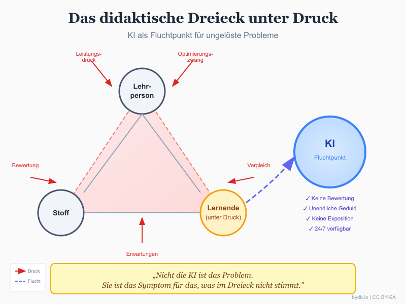

> [!abstract] Zusammenfassung
> Das didaktische Dreieck zwischen Lehrperson, Lernenden und Stoff steht unter Spannung. Jugendliche fliehen zunehmend zur KI – nicht aus Faulheit, sondern weil sie dort etwas finden, das im Klassenzimmer knapp geworden ist: urteilsfreie Verfügbarkeit. Diese Flucht ist keine bewusste Entscheidung gegen Schule. Sie ist ein Symptom.

## Wie dieser Gedanke entstand

Die Idee zu diesem Artikel entstand durch einen Vortrag von [Prof. Dr.-Ing. Dr. phil. Dominikus Herzberg](https://www.thm.de/mni/dominikus-herzberg) von der Technischen Hochschule Mittelhessen. Herzberg ist ein besonderer Brückenbauer zwischen Informatik und Didaktik – er hat nicht nur einen Doktor in Ingenieurwissenschaften, sondern auch bei [Prof. Dr. Gabi Reinmann](https://www.hul.uni-hamburg.de/ueber-uns/personen/profs/gabi-reinmann.html) an der Universität Hamburg in Wissenschaftsdidaktik promoviert.[^5]

Reinmann leitet dort das Hamburger Zentrum für Universitäres Lehren und Lernen und ist eine der wichtigsten Stimmen, wenn es um die Frage geht, wie Lehren und Lernen zusammenhängen – oder eben nicht. Herzberg und Reinmann haben gemeinsam das Buch „Forschendes Entwerfen: Design-Based Research für die Hochschuldidaktik" veröffentlicht.[^6]

Als Herzberg in seinem Vortrag über das didaktische Dreieck sprach und Reinmanns Arbeiten zitierte, setzte das einen Impuls in mir, der mich seitdem nicht mehr loslässt: Was passiert, wenn dieses Dreieck unter so viel Druck gerät, dass Jugendliche einen Ausweg suchen? Und was, wenn dieser Ausweg KI heißt?

## Der Riss im Dreieck

Das didaktische Dreieck – Lehrperson, Lernende, Stoff – ist seit Jahrzehnten das Grundmodell pädagogischen Denkens. Es beschreibt, wie Wissen vermittelt wird, wie Beziehungen funktionieren, wie Lernen entsteht.

Aber dieses Dreieck gerät unter Spannung. Und zwar von allen Seiten gleichzeitig.

Gabi Reinmann bringt die Spannung in diesem Dreieck auf den Punkt:

> „Das Verhältnis von Lernen und Lehren ist allerdings komplex und entspricht nicht einem einfachen Verhältnis gleich dem von Geben und Nehmen, von Verkaufen und Kaufen, von Veräußern und Aneignen."[^1]

Es ist komplexer, fragiler, als wir oft wahrhaben wollen.

Was passiert, wenn die Seiten dieses Dreiecks zu eng werden? Wenn der Druck von außen – Leistungserwartungen, Optimierungszwang, Vergleichsdynamiken durch Social Media – so stark wird, dass die Beziehungen im Dreieck nicht mehr tragen?

## Der vierte Akteur betritt die Bühne

Und dann kommt KI.

ChatGPT, Claude, Gemini – sie bieten etwas, das im klassischen Dreieck knapp geworden ist: **urteilsfreie Verfügbarkeit**. Keine Bewertung. Keine soziale Konsequenz. Unendliche Geduld. Keine Enttäuschung bei der dritten Nachfrage.

Ich muss hier an meine eigene Erfahrung denken. Wenn ich die KI etwas frage, urteilt sie nicht. Sie seufzt nicht. Sie schaut nicht auf die Uhr. Sie fragt nicht, warum ich das nicht schon längst verstanden habe.

Das klingt banal. Aber für Jugendliche, die täglich unter Beobachtung stehen, ist das nicht banal. Es ist eine Erleichterung.

> [!warning] Die unsichtbare Fluchtbewegung
> Jugendliche ziehen sich zunehmend aus dem didaktischen Dreieck heraus – und KI wird zum Fluchtpunkt. Das ist keine bewusste Entscheidung gegen Schule. Es ist eine Anpassungsbewegung an unerträglichen Druck.

Reinmann schreibt:

> „Lehren ist stets in irgendeiner Form sichtbar; wie jemand lernt, ist dagegen weitgehend unsichtbar: Wir können das Lerngeschehen selbst nicht sehen; wir sehen nur die Bemühung und das Resultat, an dem man abzulesen versucht, ob etwas gelernt worden ist oder nicht."[^2]

Genau hier setzt die KI an: Sie macht Lernen wieder unsichtbar – aber diesmal ohne die soziale Kontrolle. Der Lernprozess findet in einem geschützten Raum statt.

## Die zentrale Ambivalenz

Hier liegt das Problem, das mich umtreibt: Ist diese Flucht gut oder schlecht? Die Antwort ist nicht einfach.

### Perspektive 1: KI als Entlastung

Jugendliche finden einen niedrigschwelligen Zugang zu Erklärungen, Unterstützung, Orientierung. Die KI fängt auf, was das System nicht mehr leisten kann. Sie schließt Lücken – zeitlich, emotional, didaktisch.

Aus konstruktivistischer Sicht ist das durchaus legitim:

> „Lernen ist aus konstruktivistischer Sicht ein autopoietischer Vorgang, der nur ermöglicht oder durch Störungen angeregt werden kann. [...] Lehren und Lernen gelten als unterschiedliche Systeme, die allenfalls lose miteinander gekoppelt sind."[^3]

Wenn das so ist – warum sollte dann nicht auch eine KI als Ermöglichungsraum fungieren?

### Perspektive 2: KI als Vermeidung

Aber die Flucht aus dem Dreieck bedeutet auch: Beziehungen werden umgangen. Die produktive Reibung mit einer Lehrperson. Das Aushalten von Nicht-Verstehen. Die soziale Dimension des Lernens. All das wird ausgelagert an eine Maschine.

Reinmann betont die Relevanz genau dieser Dimension:

> „Gerade beim technologiegestützten Lehren und Lernen, das man gerne mit einer Effizienzsteigerung in der Bildung in Verbindung bringt, ist es schließlich eine höchst relevante Frage, wie es um die Art und den Anteil der Betreuung in einem didaktischen Szenario bestellt ist."[^4]

Die Betreuung – das ist die soziale Seite des Lehrens. Und genau diese wird bei der Flucht zur KI ausgehebelt.

## Was ich beobachte

In meiner Arbeit sehe ich beides. Ich sehe Jugendliche, die durch KI endlich Zugang zu Themen finden, die ihnen vorher verschlossen waren. Die keine Angst mehr haben, dumme Fragen zu stellen. Die in ihrem eigenen Tempo lernen können.

Aber ich sehe auch die andere Seite. Die Erwartung, dass alles sofort erklärt wird. Die Ungeduld mit menschlichen Lehrenden, die nicht so schnell und so perfekt antworten wie die Maschine. Die schleichende Verschiebung dessen, was als normal gilt.

> [!tip] Die eigentliche Frage
> Wenn Jugendliche aus dem Dreieck fliehen, sollten wir fragen, was im Dreieck nicht stimmt. Nicht die KI ist das Problem. Sie ist das Symptom.

## Was das für uns bedeutet

Ob wir es wollen oder nicht: KI wird ein Zufluchtsort für ungelöste Probleme. Das ist keine Dystopie. Es ist eine Beschreibung dessen, was bereits passiert.

Die Frage ist nicht, ob wir KI in der Bildung zulassen. Sie ist längst da. Die Frage ist: **Wie gestalten wir das didaktische Dreieck so, dass es wieder ein Ort sein kann, an dem Jugendliche bleiben wollen?**

Das bedeutet vielleicht:
- Weniger Bewertungsdruck
- Mehr Raum für echte Fragen
- Beziehungen, die tragen
- Zeit, die nicht getaktet ist

Und ja, vielleicht wird aus dem Dreieck ein Viereck – mit KI als neuem Pol. Oder die KI bleibt ein Außenraum, ein Werkzeug, ein Puffer zwischen den Spannungen.

## Schlusswort

Ich habe keine abschließende Antwort. Aber ich habe eine Beobachtung, die mich nicht loslässt: Die Flucht zur KI ist keine Faulheit. Sie ist keine Verweigerung. Sie ist eine Reaktion auf etwas, das nicht mehr funktioniert.

Wenn wir verstehen wollen, was KI mit der Generation Z macht, müssen wir zuerst verstehen, was wir mit der Generation Z gemacht haben. Welchen Druck wir aufgebaut haben. Welche Beziehungen wir vernachlässigt haben. Welche Räume wir geschlossen haben.

Die KI öffnet einen neuen Raum. Die Frage ist, ob wir bereit sind, das als Hinweis zu verstehen – und nicht nur als Bedrohung.

---

## Literatur

[^1]: Reinmann, G. (2013). Didaktisches Handeln. Die Beziehung zwischen Lerntheorien und Didaktischem Design. In M. Ebner & S. Schön (Hrsg.), *L3T. Lehrbuch für Lernen und Lehren mit Technologien* (2. Auflage). https://doi.org/10.25656/01:8338

[^2]: Ebd.

[^3]: Ebd.

[^4]: Ebd.

[^5]: Herzberg, D. (2023). *Konzeption einer Wissenschaftsdidaktik für die Fachhochschule* (Dissertation). Universität Hamburg, Hamburger Zentrum für Universitäres Lehren und Lernen.

[^6]: Reinmann, G., Herzberg, D. & Brase, A. (2024). *Forschendes Entwerfen: Design-Based Research in der Hochschuldidaktik*. transcript Verlag. https://doi.org/10.14361/9783839474242
